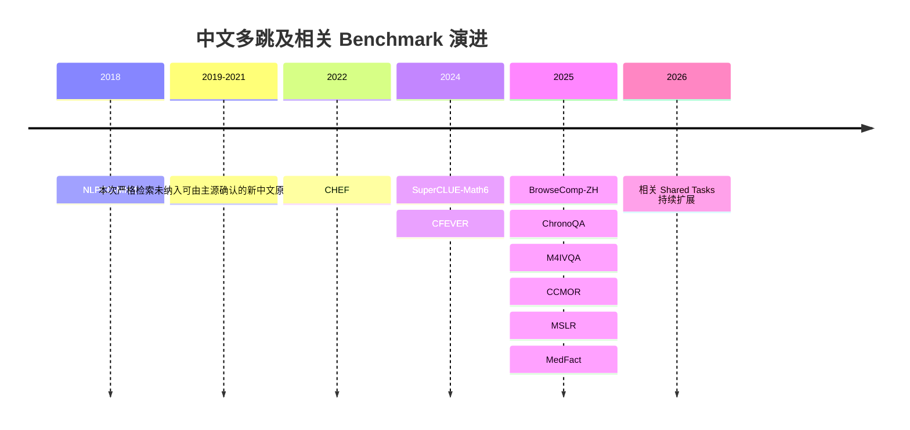
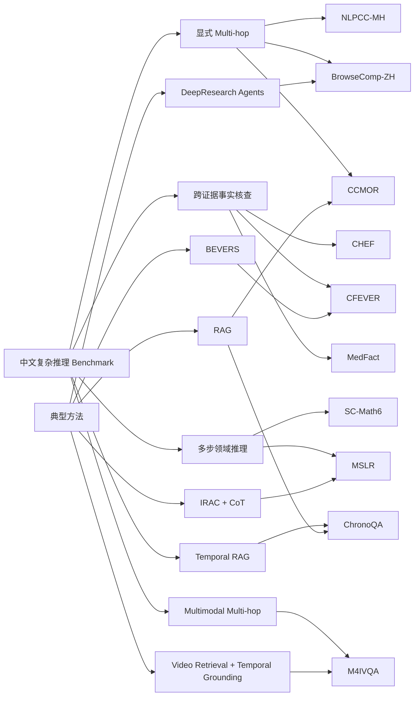

# 中文多跳与多跳相关 Benchmark 深度调研报告

## 执行摘要

本报告以 **2019–2026 年**为主要时间范围，截至 **2026 年 9 月 30 日**检索中文原生或以中文为核心语言的多跳问答、多文档推理、多步链式推理、证据式事实核查、时序推理和多模态多跳任务，并优先使用原始论文、ACL Anthology、AAAI、arXiv、官方项目页和作者 GitHub 作为信息源喵  

首先需要澄清一个对研究设计非常重要的事实：**中文“显式多跳”benchmark 的数量明显少于泛称“复杂推理”的中文 benchmark**，而且不同论文对 multi-hop 的定义并不统一喵  
多跳 QA 文献通常把问题的关键特征概括为需要组合多个事实或执行多个推理步骤才能得到答案，而现实 benchmark 又可以把“跳”实现为知识图谱关系跳、跨文档证据组合、网页迭代搜索、时间链、因果链或跨模态检索链，因此不能把所有“困难 QA”都直接称作多跳 QA 喵 citeturn6search3  

本次调研最终重点纳入十个具有代表性的中文 benchmark，其中 **NLPCC-MH** 是 2018 年发布、严格来说超出用户指定时间窗，但它是目前中文知识图谱多跳 QA 的重要历史锚点，因此保留并明确标记为 legacy benchmark 喵 citeturn9search5  
在 2019–2026 主时间窗内，最值得研究者优先关注的分别是 **CHEF、CFEVER、SuperCLUE-Math6、BrowseComp-ZH、ChronoQA、M4IVQA、CCMOR、MSLR 和 MedFact** 喵 citeturn14search0turn14search1turn19academia32turn15academia27turn19academia31turn17academia40turn16academia35turn16academia33turn19search0  

从“是否真的测多跳”来看，可以把这些基准分成三个层次喵  

**第一层是显式多跳 benchmark**，即任务定义本身明确要求两跳以上信息组合，包括 NLPCC-MH 的 2-hop/3-hop KGQA、BrowseComp-ZH 的开放中文网页多跳搜索、CCMOR 的中文常识 factual-unit chain 推理，以及 M4IVQA 的跨视频、文本、知识图谱与时间定位的多模态多跳推理喵 citeturn9search5turn15search1turn16academia35turn17academia40  

**第二层是跨证据或跨文档推理 benchmark**，其中 CFEVER、ChronoQA 最接近经典 multi-hop retrieval-and-reasoning 范式，前者允许支持证据跨多个中文 Wikipedia 页面，后者明确包含单文档和多文档时序 QA 喵 citeturn18view2turn19academia31  
不过 CFEVER 的作者自己指出，多数样本仍然只依赖一个 Wikipedia 页面，其测试集中非 NEI 样本约 **89.45% 为单页、9.35% 为两页、1.20% 为三页或更多页**，所以不能简单把整个 CFEVER 称作“纯多跳数据集”喵 citeturn18view2  

**第三层是多步或复杂推理相关 benchmark**，包括 SC-Math6 的数学多步推理、MSLR 的专家 IRAC 法律推理链、CHEF 和 MedFact 的证据式事实核查喵 citeturn19academia32turn20view4turn14search0turn19search22  
这些数据非常适合研究 reasoning，但它们测量的并不一定是传统意义上的“跨文档 hop 数”喵  

从研究价值来看，当前最明显的空白不是“缺少中文困难题”，而是**缺少同时具备中文原生、多文档、显式人工证据链、可复现固定语料、细粒度过程评价和足够规模的统一 benchmark**喵  
例如 CFEVER 有人工 evidence set 但没有有序推理链，BrowseComp-ZH 有很强的真实多跳搜索需求但依赖动态 Web，CCMOR 明确构造 factual-unit chains 但公开摘要没有证明 released dataset 提供逐样本人工有序链，MSLR 则有最强的专家推理轨迹监督，却集中于内幕交易法律场景而不是开放域 QA 喵 citeturn18view2turn15academia27turn16academia35turn20view4  

因此，从数据选择角度看，**做开放域 agentic multi-hop retrieval 应优先 BrowseComp-ZH，做固定语料跨文档事实推理应优先 CFEVER，做显式推理过程监督应优先 MSLR，做中文知识链研究可优先 CCMOR，做 temporal RAG 应选 ChronoQA，做多模态多跳应选 M4IVQA，而 NLPCC-MH 更适合作为历史兼容基线而不是现代主要 benchmark**喵 citeturn15academia27turn18view2turn20view4turn16academia35turn19academia31turn17academia40turn9search5  

## 范围、定义与检索方法

本报告把“中文 benchmark”定义为问题、claim、案例或主要输入以中文构造，而不是简单把英文 benchmark 机器翻译成中文喵  
任务至少满足以下条件之一才被纳入核心分析：论文明确使用 multi-hop 或 multi-step 定义任务，需要跨两个以上文档或证据源完成推理，提供显式 reasoning trace，或者通过多个检索、验证、时间或模态阶段才能得到最终答案喵  

对于 CHEF、MedFact 这类并非每个样本都能证明具有两个以上 hop 的数据，本报告采用“**多跳相关**”而非“纯多跳 benchmark”的表述喵  
这一区分尤其重要，因为 CHEF 的设置已经给出候选 evidence，而 CFEVER 则要求从固定中文 Wikipedia 数据库执行 document retrieval、sentence retrieval 和 claim verification，因此两者表面上都叫 evidence-based fact checking，实际测量的系统能力并不相同喵 citeturn18view4  

本报告对“人工标注证据链”采用较严格标准喵  
只有当 benchmark 提供由人类专家构造或逐项审核的、能够表示**中间推理步骤或有序推理轨迹**的数据时才记作 Yes，而“人工标注了若干 supporting evidence sentences”但没有顺序和推理关系的 benchmark 仍记作 No，并在表格中注明它拥有 evidence set 喵  
按照这个标准，MSLR 的 expert-derived IRAC-Traces 是明确的 Yes，而 CFEVER 尽管人工标注了支持证据集合，仍不等价于有序 reasoning chain 喵 citeturn20view4turn18view0  

“SOTA”也需要谨慎处理喵  
不同论文经常改变模型版本、提示、检索器、候选文档、闭源 API 版本和评测时间，因此本报告优先报告**原论文或官方 shared task 中可核实的最高数值**，而不会把设置不同的后续分数强行排列为统一全球 SOTA 喵  
特别是 BrowseComp-ZH 这类 live-Web benchmark，2026 年已有 Tongyi DeepResearch 项目宣称在 BrowseComp-ZH 等搜索 benchmark 达到 SOTA，但当前抓取的官方仓库摘要没有暴露对应 BrowseComp-ZH 的精确数字，因此本报告仍把原始 BrowseComp-ZH 论文中可直接核实的 **DeepResearch 42.9%** 作为“原论文最高报告值”，而不伪造一个所谓当前 SOTA 喵 citeturn13search23turn15academia27  

截至检索截止日，本报告还核查了正在进行的 NLPCC 2026 shared tasks，例如 Task 10 已公开 scientific reporting 的 claim-level faithfulness 和 citation-level faithfulness 任务，但其公开页面不足以确认它属于“中文原生多跳 benchmark”，所以没有为了凑数量把它计入核心中文表格喵 citeturn17search13  

## 基准全景与逐项比较

**表 A 给出数据设计、规模、输入来源、标签与开放情况喵**

| Benchmark | 发布时间 / 论文 | 任务类型与“多跳强度” | 数据规模与拆分 | 数据来源 | 问题 / 标签类型 | 人工证据链 | 可用性与许可 | 来源 |
|---|---|---|---|---|---|---|---|---|
| **NLPCC-MH†** | 2018，CCKS，作为 legacy anchor | 中文知识图谱多跳 QA，显式 2-hop / 3-hop | Train 4,000；Test 1,000；约 80% 2-hop、20% 3-hop；无公开 dev | 从 NLPCC 2016 KBQA 扩展知识图谱三元组路径 | 实体答案 / relation-path QA | **No**，路径由自动扩展产生 | [GitHub](https://github.com/wavewangyue/NLPCC-MH)；许可未说明 | citeturn9search5turn9search3 |
| **CHEF** | 2022，NAACL，Hu et al. | evidence-based fact checking；多跳相关而非严格逐样本多跳 | 约 10K claims；当前主源未显示精确 train/dev/test，记为未说明 | 真实网络 claim + 从互联网检索并标注的 evidence；任务本身不要求完整文档检索 | 真实性分类 + evidence annotation；完整 label taxonomy 当前摘要未列出 | **No**，有人标 evidence 但非有序链 | [论文](https://aclanthology.org/2022.naacl-main.246/)；[GitHub](https://github.com/thu-bpm/chef)；数据许可未说明 | citeturn14search0turn14search4turn14search7turn18view4 |
| **CFEVER** | 2024，AAAI | fact extraction + verification；包含真正跨页 evidence 的子集 | 30,012 claims；当前所取主源未给精确 split，记为未说明 | 固定中文 Wikipedia corpus；证据可来自单页或多页 | Supports / Refutes / Not Enough Info + evidence sentences | **No**，有人标 evidence set，但不是有序 reasoning chain | [项目页](https://ikmlab.github.io/CFEVER/)；[Data GitHub](https://github.com/IKMLab/CFEVER-data)；Apache-2.0 | citeturn14search1turn14search8turn18view0 |
| **SuperCLUE-Math6 / SC-Math6** | 2024，arXiv | 中文数学多步推理 | 超过 2,000 道题；split 未说明 | 中文数学应用题，自包含问题 | 生成答案 + 自然语言多步解法 | **No**，有 reasoning solution，但不是人工证据链 | [论文](https://arxiv.org/abs/2401.11819)；官方数据许可在本次主源检索中未说明 | citeturn19academia32 |
| **BrowseComp-ZH** | 2025，arXiv | **显式开放网页 multi-hop retrieval + reasoning** | 289 道题；benchmark/test 型设置，无 train/dev | 中文 Web，11 个领域，跨平台多步搜索；从短客观答案反向构题 | 短客观生成答案，例如日期、数字、专名 | **No**，公开任务不提供人工有序 evidence chain | [GitHub](https://github.com/PALIN2018/BrowseComp-ZH)；数据加密发布；许可未说明 | citeturn15search1turn15academia27 |
| **ChronoQA** | 2025，arXiv | temporal-sensitive RAG QA；含单文档和多文档推理 | 5,176 questions；语料来自 300K+ 新闻；split 未说明 | 2019–2024 新闻文章，单文档 + 多文档 | absolute / aggregate / relative temporal QA，显式和隐式时间表达 | **No**，有结构化标注与人工验证，但主源没有说明有序 evidence chain | [论文](https://arxiv.org/abs/2508.12282)；数据许可未说明 | citeturn19academia31 |
| **M4IVQA** | 2025，NLPCC Shared Task 4 | **多模态 + 多语言 + multi-hop 医疗视频 QA**，三个 track | Train 5,840 QA / 1,228 videos；Dev 983 / 200；Test 1,022 / 200；合计 7,845 QA | 视频、音频、字幕、知识图谱；中文统一为简体 | temporal grounding、video retrieval、corpus retrieval + localization | **No**，有 gold video / span / KG，但无人工步骤链 | [官方页](https://cmivqa.github.io/)；许可未说明 | citeturn17academia40turn21view0 |
| **CCMOR** | 2025，arXiv | **Chinese Commonsense Multi-hop Reasoning**，显式多跳 | 公开摘要未给精确规模和 split，记为未说明 | domain-balanced seed QA + factual-unit chains；LLM 生成后专家 human-in-the-loop 校验 | multi-hop QA；公开摘要未说明是生成式还是固定选项 | **No†**，构造依赖 factual-unit chain，但当前主源不能确认 released item 提供人工有序 chain annotation | [论文](https://arxiv.org/abs/2510.08800)；数据许可 / repo 当前主源未说明 | citeturn16academia35 |
| **MSLR** | 2025，arXiv | **中文多步法律推理**，过程级 benchmark | 1,389 份法律文书；59,771 step-level labels；平均约 43 个结构字段 / 文档 | 2005–2024 年 CSRC、最高检、最高法等官方内幕交易相关法律文件 | structured extraction + 开放式 IRAC reasoning | **Yes**，专家定义 IRAC-Traces 且逐项人工审核 | [GitHub](https://github.com/yuwenhan07/MSLR-Bench)；数据许可未明确；论文 arXiv 页面标 CC BY 4.0 | citeturn20view4 |
| **MedFact** | 2025，EMNLP | 中文 evidence-based medical fact checking；复杂推理相关 | 1,321 questions；7,409 atomic claims；split 当前主源未说明 | webMedQA 问题 → LLM response → claim decomposition → evidence retrieval + 人工验证 | Supported / Partially Supported / Refuted / Uncertain / Not Applicable | **No**，claim-evidence supervision，不是有序 chain | [论文](https://aclanthology.org/2025.emnlp-main.1646/)；[GitHub](https://github.com/AshleyChenNLP/MedFact)；许可未说明 | citeturn19search0turn19search3turn19search22 |

† NLPCC-MH 不属于 2019–2026 主时间窗，但由于后续中文多跳 KGQA 研究持续使用它，本报告把它当作历史基线而非“近年新 benchmark”喵 citeturn9search5turn9search3  

**表 B 集中给出评价指标、样例、baseline / 已报道最高结果和局限喵**

其中“示意”明确表示为了说明任务形式而写的合成示例，不冒充数据集中的真实原始文本喵  

| Benchmark | 评价指标 | 中文示例 | 已报道 baseline / 可核实最高结果 | 已知偏差与局限 | 来源 |
|---|---|---|---|---|---|
| **NLPCC-MH** | 后续工作常用 F1、Hits@1；不同论文设置并不完全一致 | 原始例：“谁饰演了万磁王的儿子”；“谁饰演了变形女的上司的儿子” | 2022 年知识图谱嵌入多跳方法报告平均 **F1=0.653**；2025 PBJ 论文报告 Hits@1 比 ChineseBERT 高 **1.26 个百分点**，但抓取摘要未给绝对值 | 由单跳自动扩展产生，存在 entity / relation 噪声；规模小；模板和 KG 路径模式明显；KnowledGPT 后续甚至手工筛出 59 条 clean subset | citeturn9search5turn9search3turn9search10turn7search3 |
| **CHEF** | evidence retrieval + veracity prediction；原论文提供多种 baseline；当前主源摘要未完整暴露具体指标表 | 示意：“某网络公共卫生传言是否被给定网页证据支持或反驳” | 原论文提出 latent evidence retrieval 与 veracity 联合端到端方法并与 established baselines 比较；当前可访问主源未显示可靠精确分数，因此不臆测 SOTA | candidate evidence 已提供，不像 FEVER/CFEVER 那样从完整 corpus 做 document retrieval；只有约 10K claims；事实核查复杂度不等于显式 hop 数 | citeturn14search0turn14search7turn18view4 |
| **CFEVER** | Doc Recall、Sentence Recall、Label Accuracy、**FEVER Score** | 论文跨页示例要点涉及需要通过另一页面确认“伊拉克—中东”背景关系；此处为论文样例含义概述而非逐字 claim | BEVERS：Doc Recall **92.60**、Sentence Recall **86.60**、RTE Accuracy **69.73**、full-pipeline FEVER **64.80**；作者 baseline full-pipeline FEVER **52.47** | 非 NEI 测试样本约 89.45% 只需单页；跨页时 FEVER 大幅下降；作者明确称其并非理想的复杂 reasoning dataset | citeturn18view2turn18view3 |
| **SC-Math6** | 按不同推理步数进行分级评价；核心是多步数学正确率 | 示意：“经过多次数量变化或比例运算后求最终数值”；公开摘要没有展示可安全逐字转录的题目 | 原论文评测 13 个代表性中文模型，**GPT-4 为其中最高水平模型**；摘要没有暴露精确总分，所以不虚构数值 | 测的是数学 step complexity，不涉及跨文档检索；规模仅 2K+；可与 multi-hop QA 类比，但不能直接互换 | citeturn19academia32 |
| **BrowseComp-ZH** | Accuracy；官方仓库还提供 accuracy / calibration-error 统计脚本 | 数据集公开时加密以减少污染，因此这里不泄露具体测试题；题目通常需要跨平台多步搜寻后返回一个日期、数字或实体 | 原论文 20+ 系统中大量模型 **<10%**，仅少数 **>20%**；原论文最好 OpenAI DeepResearch **42.9%**；2026 Tongyi DeepResearch repo 宣称在该 benchmark 达 SOTA，但公开抓取摘要未给精确值 | Web 内容和搜索排序随时间变化；搜索引擎、地区和访问权限影响结果；容易把 retrieval engineering 与 reasoning 混在一个 Accuracy 中 | citeturn15search1turn15academia27turn13search23 |
| **ChronoQA** | 原始摘要强调 structured temporal evaluation；具体完整 metric 表在当前主源摘要中未说明 | 示意：“某事件发生后的第几天发布第二次公告”；包含绝对、聚合和相对时间关系 | 公开摘要没有给 baseline 的可核实精确分数，因此记为未说明 | 新闻来源集中在 2019–2024；主要挑战是 temporal alignment，不代表所有一般性 multi-hop；新闻更新和时间语义可能造成版本问题 | citeturn19academia31 |
| **M4IVQA** | M4TAGSV：mIoU、R@1 IoU 阈值；M4VCR：R@1/10/50、MRR；M4TAGVC：retrieval-conditioned mIoU | 原始论文例：“如何通过心肺复苏急救窒息患者”；corpus track 需先找视频再定位约 **1:40–1:54** 的片段 | Track 1 Baichuan mIoU **0.3717**；Track 2 DIMA R@1 **0.3264**、MRR **0.3407**；Track 3 MedEcho Average **0.2314** | 错误会从跨语种理解传播到视频检索，再传播到时间定位；视频和 KG 资源使复现成本远高于文本 QA | citeturn21view1turn21view2turn21view3 |
| **CCMOR** | 论文公开摘要确认系统评测与 RAG 对比，但未暴露完整 metric / score 表 | 示意：“由一个中国文化事实找到中间实体，再用第二个事实推出目标答案” | 原论文报告 SOTA LLM 仍在 long-tail knowledge 和 knowledge-intensive multi-step reasoning 上存在明显不足，并报告 RAG 带来显著提升；精确数值当前主源未显示 | LLM-assisted generation 可能产生构造痕迹；虽然专家参与验证，仍需进一步测试 shortcut、模板和 contamination | citeturn16academia35 |
| **MSLR** | **IRAC Recall** + **LLM Score**；另有 FCR / Overall Acc 用于 annotation task | 示意：“当事人获悉重大未公开信息后交易证券，依据事实、规则、适用过程和结论判断是否构成内幕交易” | Standard Input 中 **o1-mini IRAC Recall=72.49**；**DeepSeek-R1 LLM Score=94.82** 但 IRAC Recall 仅 **65.81**；说明表面逻辑质量与专家路径一致性并非同一件事 | 聚焦内幕交易，domain coverage 窄；LLM-as-a-Judge 仍具有 evaluator dependency；专家法律路径不一定唯一 | citeturn21view11turn20view4 |
| **MedFact** | 五分类 evidence-based claim verification；当前摘要未列完整 aggregate metric 数值 | 示意：“LLM 回答中声称某治疗适用于某病且不存在某禁忌，将回答拆成 atomic claims 后逐条对证据验证” | 原论文比较 ICL 与 fine-tuning 多种设置；当前公开摘要没有给可安全报告的统一最好分数，记为未说明 | 只针对医疗领域和 LLM-generated content；原论文错误分析指出 medical ambiguity、semantic containment、medical synonymy 是持续难点 | citeturn19search22turn19search0 |

这里最值得注意的是 CFEVER 的跨页性能塌陷喵  
BEVERS 在单页样本上的 Accuracy / FEVER Score 为 **73.95 / 70.54**，在两页样本上下降为 **63.10 / 21.93**，在三页及以上样本上则为 **58.33 / 16.67**，这几乎是一个直接的实证信号：**“最后标签判断正确”远比“找齐全部跨页证据”容易**喵 citeturn18view2  

另一个非常值得论文讨论的结果来自 MSLR 喵  
DeepSeek-R1 在标准输入下获得 **94.82 的 LLM Score**，但只有 **65.81 的 IRAC Recall**，而 o1-mini 的 IRAC Recall 达到 **72.49**，说明“生成一段看起来很有逻辑的 CoT”与“覆盖专家实际使用的关键法律推理节点”并不是同一个能力喵 citeturn21view11  

**按研究目标做数据选择时，可以使用下面的快速决策矩阵喵**

| 研究目标 | 首选 Benchmark | 次选 | 原因 |
|---|---|---|---|
| 纯中文显式 multi-hop KGQA | NLPCC-MH† | CCMOR | 前者 hop 数最明确；后者更现代且结合中文常识 |
| 开放域深度搜索 agent | BrowseComp-ZH | CCMOR + 自建 retrieval | 真实中文 Web、逆向难题、跨平台检索 |
| 固定语料跨文档 fact reasoning | CFEVER | CHEF | CFEVER 有完整 document→sentence→verification pipeline |
| temporal multi-document RAG | ChronoQA | 自建新闻集 | 明确覆盖 aggregate / relative temporal reasoning |
| reasoning-process supervision | MSLR | SC-Math6 | MSLR 有专家 IRAC-Traces；SC-Math6 有自然语言多步解法 |
| 高风险 fact checking | MedFact | CHEF / CFEVER | 医疗 claim-level evidence supervision |
| multimodal multi-hop | M4IVQA | — | 视频检索、KG、跨语种理解与时间定位被统一起来 |

因此，别误会，“最大的数据集”并不自动意味着“最好的多跳 benchmark”喵  
CFEVER 有 30K claims，但绝大多数不是跨页；BrowseComp-ZH 只有 289 道题，却能让原论文中最好的 DeepResearch 系统也只有 42.9% accuracy；MSLR 只有 1,389 份案例，却包含接近 60K 个过程级结构标签喵 citeturn18view2turn15academia27turn20view4  

## 覆盖分布、时间线与关系结构

下图按照本报告的研究性分类统计十个重点 benchmark，其中 NLPCC-MH 作为 legacy anchor 一并计入，因此这里展示的是“本报告覆盖结构”，而不是声称存在一个官方 benchmark taxonomy 喵  

从分布可以看到，显式 multi-hop / Web QA 与 evidence-based fact checking 是目前最主要的两组，而真正针对时序、多模态以及过程级 reasoning 的数据仍较少喵 citeturn15academia27turn14search0turn14search1turn17academia40turn20view4  
[下载任务分布 PNG](sandbox:/mnt/data/chinese_multihop_task_distribution.png) 喵  

下面的数据规模图采用**对数横轴**，因为 BrowseComp-ZH 的 289 个题目与 CFEVER 的 30,012 个 claims 相差两个数量级以上喵  
这里还必须强调，不同 benchmark 的“样本单位”不是严格可比的，MSLR 用文书数、MedFact 用 atomic claims、M4IVQA 用 QA pairs，SC-Math6 的公开摘要只能确定为大于 2,000，因此图中的规模只能辅助理解，不能用于评价 benchmark 质量喵 citeturn15academia27turn14search1turn20view4turn19search0turn21view0turn19academia32  

CCMOR 因当前主源没有暴露可以可靠核实的精确数据规模，没有放入规模图，以免制造虚假的精确度喵 citeturn16academia35  
[下载数据规模 PNG](sandbox:/mnt/data/chinese_multihop_dataset_sizes.png) 喵  

发布时间线可以概括如下，其中 2018 年节点仅用于说明 NLPCC-MH 这一历史锚点喵  

这条时间线显示出一个较明显的发展方向：早期中文多跳研究更接近 KGQA，而 2024–2025 年之后任务开始快速向 **开放 Web、跨页 evidence、时序 RAG、专家 reasoning trace 和多模态 agentic reasoning** 扩展喵 citeturn9search5turn14search1turn15academia27turn19academia31turn17academia40turn20view4  

从能力结构上看，这些 benchmark 之间可以用下面的关系图理解喵  

这个图也揭示了当前中文 benchmark 的一个结构性问题：**数据集往往只覆盖整个 reasoning pipeline 的某一段，而不是同时评价 retrieval、evidence-chain correctness、reasoning faithfulness 和 final answer**喵  
CFEVER 是少数把 document retrieval、sentence retrieval 和 final verification 显式串联起来的中文数据，而 MSLR 又是少数真正评价 intermediate reasoning trace 的数据，但二者分别缺失另一方的能力维度喵 citeturn18view0turn18view2turn20view4  

## 代码、复现与常用评测方法

下面的“复现难度”是基于公开资产、外部依赖、数据动态性和计算基础设施做出的研究者视角判断，不是原论文给出的官方等级喵  

| Benchmark / 实现 | 官方资源 | 复现难度 | 主要原因 |
|---|---|---:|---|
| **NLPCC-MH** | [wavewangyue/NLPCC-MH](https://github.com/wavewangyue/NLPCC-MH) | 低–中 | 数据小、静态；但原始 KG 与旧代码环境、数据噪声会影响完全复现 citeturn9search5turn9search3 |
| **CHEF** | [thu-bpm/chef](https://github.com/thu-bpm/chef) | 中 | 论文代码与数据公开，训练需 GPU；证据建模 pipeline 比普通分类复杂 citeturn14search7 |
| **CFEVER** | [CFEVER-data](https://github.com/IKMLab/CFEVER-data)；项目另提供 baseline repo 与 leaderboard | 中–高 | 要完整复现实验需中文 Wikipedia fact DB、document retrieval、sentence retrieval、RTE 三阶段；数据为 Apache-2.0 citeturn14search8turn14search23turn18view2 |
| **BrowseComp-ZH** | [PALIN2018/BrowseComp-ZH](https://github.com/PALIN2018/BrowseComp-ZH) | **高** | 数据虽公开但加密；完整系统依赖搜索引擎、浏览工具和 agent loop；实时 Web 会导致检索结果漂移 citeturn15search1turn15academia27 |
| **M4IVQA** | [官方 Challenge 页面](https://cmivqa.github.io/) | **很高** | 视频、音频、字幕、KG、跨语种 retrieval 和 temporal localization 多组件耦合 citeturn17academia40turn21view0turn21view1 |
| **MSLR** | [yuwenhan07/MSLR-Bench](https://github.com/yuwenhan07/MSLR-Bench) | 中 | 数据与代码公开；但长法律文本、闭源 / 大模型 baseline 和 LLM-as-a-Judge 会带来成本与版本依赖 citeturn20view4turn21view11 |
| **MedFact** | [AshleyChenNLP/MedFact](https://github.com/AshleyChenNLP/MedFact) | 中 | claim-level 数据公开；ICL 较容易，完整 fine-tuning 和多模型实验成本较高 citeturn19search0turn19search22 |
| **SC-Math6 / ChronoQA / CCMOR** | 本次可核实主源首先定位到论文；未找到足以在报告中确认完整官方代码资产的来源 | 中–高 / 未定 | 为保持严谨，不根据第三方镜像推断“官方 repo 存在” citeturn19academia32turn19academia31turn16academia35 |

如果目标是**最容易搭建一个可重复实验环境**，CFEVER 和 NLPCC-MH 比 BrowseComp-ZH 更容易控制变量，因为它们基于固定数据而不是 live search 喵 citeturn14search8turn9search5turn15search1  
如果目标是评估真实 agentic search，则恰好相反，BrowseComp-ZH 的动态中文 Web 环境具有更高外部效度，只是牺牲了一部分实验可重复性喵 citeturn15academia27  

现有 benchmark 的主流评测方法大致可以归纳为五类喵  

| 评价范式 | 典型指标 | 代表 benchmark | 它实际测量的东西 |
|---|---|---|---|
| 最终答案评价 | Accuracy、Exact-style correctness | BrowseComp-ZH、部分 QA | 是否得到正确最终答案，但无法直接定位哪个 hop 出错 |
| Evidence retrieval | Recall、R@K、MRR | CFEVER、M4VCR | 是否找到完整支持材料或目标视频 |
| Joint evidence + answer | FEVER Score | CFEVER | 标签必须正确且 evidence set 满足严格要求 |
| Process-level reasoning | IRAC Recall、LLM Score | MSLR | 推理步骤覆盖率与逻辑连贯性 |
| Localization | IoU、mIoU、R@1 IoU threshold | M4IVQA | 是否找到正确视频片段及其时间边界 |
| Step-stratified reasoning | 按推理步骤分层统计 | SC-Math6 | 模型随着 reasoning depth 增加的性能衰减 |

CFEVER 的 FEVER Score 尤其值得多跳研究借鉴，因为单纯 label Accuracy 可能让模型即使没有找齐关键跨页证据也获得正确标签，而 FEVER Score 要求完整 evidence set 与正确 label 同时满足喵 citeturn18view1turn18view2  

MSLR 则代表了另一条路线，即不只问最终 conclusion 是否正确，而是用 **IRAC Recall** 衡量生成 reasoning trace 是否覆盖 expert-defined reasoning fields，再以 LLM-as-a-Judge 对整体逻辑连贯性赋分喵 citeturn20view4turn21view11  
论文还让法律专家人工检查了 380 个随机输出，自动 judge 与专家评级的 grade agreement 为 **87.96%**，说明这类 process-level automated evaluation 有一定可用性，但并不意味着 judge bias 已经消失喵 citeturn21view11  

## 失败模式、数据局限与评价陷阱

现有结果表明，中文 multi-hop 系统最常见的失败并不是单一的“不会推理”，而是多个模块级错误级联喵  

| 常见失败模式 | 观察到的证据 | 主要影响 |
|---|---|---|
| **首跳检索失败导致后续 hop 全部失效** | CFEVER 的 verification 依赖 sentence retrieval；作者指出 evidence 缺失会直接降低最终 verification | CFEVER、BrowseComp-ZH、ChronoQA citeturn18view2 |
| **跨页 evidence completeness 崩溃** | CFEVER 的 BEVERS FEVER Score 从单页 70.54 降至两页 21.93、三页以上 16.67 | CFEVER 以及类似 multi-doc fact verification citeturn18view2 |
| **long-tail knowledge 缺失** | CCMOR 报告 SOTA LLM 仍受到中国特定长尾知识和 knowledge-intensive reasoning 限制，而 RAG 可明显改善 | CCMOR、开放域 multi-hop citeturn16academia35 |
| **时间对齐与事件顺序错误** | ChronoQA 专门设计 absolute、aggregate、relative temporal questions，并同时覆盖显式和隐式时间表达 | ChronoQA、新闻 RAG citeturn19academia31 |
| **跨模态错误传播** | M4TAGVC 必须先找到正确视频，再定位正确时间片段；任一阶段失败都会使最终答案失败 | M4IVQA citeturn21view1turn21view3 |
| **CoT 看起来合理但偏离专家路径** | DeepSeek-R1 在 MSLR 的 LLM Score 94.82，但 IRAC Recall 65.81 | MSLR，以及所有只用“流畅 reasoning”当 correctness proxy 的任务 citeturn21view11 |
| **人工 CoT 反而干扰模型** | MSLR 中 QwQ-32B 使用 Human-Designed CoT 后 IRAC Recall 降 10.20、LLM Score 降 33.80 | reasoning models、prompt-based evaluation citeturn21view11 |
| **细粒度医学语义混淆** | MedFact 错误分析突出 medical ambiguity、semantic containment 和 synonymy | MedFact、高风险专业 fact checking citeturn19search22 |

由此可以看到，第一个重要评价陷阱是 **answer correctness ≠ reasoning correctness** 喵  
一个 agent 完全可能通过错误的中间事实偶然得到正确答案，也可能得到正确结论但引用了不完整证据，而只有 final Accuracy 的 benchmark 无法区分这两类情况喵  
CFEVER 中 Accuracy 与 FEVER Score 的巨大差距，以及 MSLR 中 LLM Score 与 IRAC Recall 的差距，都给出了这一问题的直接实证例子喵 citeturn18view2turn21view11  

第二个陷阱是 **live-Web benchmark 的非平稳性** 喵  
BrowseComp-ZH 的价值恰恰来自真实中文互联网，但搜索结果、网页存在性、搜索引擎索引和平台访问条件都可能变化，因此不同时间和不同地区运行相同 agent 不一定面对相同 evidence space 喵 citeturn15search1turn15academia27  
后续 BrowseComp-Plus 工作也专门指出 black-box live Web search API 会妨碍公平比较和可复现性，因此改用固定 corpus 和 human-verified supporting documents，这一批评虽然针对 BrowseComp 系列的一般方法论，却同样适用于 BrowseComp-ZH 类型的动态评测喵 citeturn15academia28  

第三个陷阱是 **把“需要多个句子”当作“真正多跳”** 喵  
CFEVER 的多证据 sentence 数量与多 page 数量不是一回事，一个 claim 可能需要同一页面中的几个句子，却不要求跨文档桥接实体，因此研究论文最好分别报告 evidence sentence count、document count 和实际 dependency-chain depth 喵 citeturn18view2  

第四个陷阱是 **SOTA 的不可比性** 喵  
在 BrowseComp-ZH 中，一个分数同时取决于基础 LLM、搜索器、query reformulation、网页访问工具、token budget 和评测时间，而 NLPCC-MH 的不同后续工作又分别采用 F1、Hits@1 等设置，因此把来自不同论文的一列数字直接排序往往没有科学意义喵 citeturn15search1turn15academia27turn9search10turn7search3  

第五个陷阱是 **LLM-as-a-Judge 可能把“语言质量”误认为“推理质量”** 喵  
MSLR 的专家复核表明 judge 与人类具有较高一致率，但同一论文仍显示高 LLM Score 与较低 IRAC Recall 可以同时出现，因此最好用结构化 gold trace、rule-based metric 和 judge metric 组合评价，而不是让 judge 单独决定 reasoning correctness 喵 citeturn21view11  

第六个陷阱是 **数据污染与 benchmark memorization** 喵  
BrowseComp-ZH 专门对公开数据进行加密以减少被预训练直接吸收的风险，而 MSLR 则用与 Lawyer LLaMA 训练法律语料之间的 ROUGE-1/2/L 相似度检查潜在重合，并报告这些分数都低于 0.03 喵 citeturn15search1turn20view4  
这两种做法分别代表了“隐藏 benchmark 内容”和“显式 contamination audit”两条路线，未来中文 benchmark 最好同时具备两者的优点喵  

最后还存在一个领域偏差问题喵  
MSLR 几乎集中在内幕交易，MedFact 集中于医疗，ChronoQA 基于新闻，而 CFEVER 的不同领域训练量也不均衡，作者观察到训练样本较少的 Sports、Technology 和 Politics 等领域表现更弱喵 citeturn20view4turn19search22turn19academia31turn18view2  
因此“某模型在一个中文 multi-hop benchmark 上表现好”并不能直接推出它具备领域无关的中文多跳能力喵  

## 研究建议与结论

基于上述 benchmark 的覆盖缺口，下一代中文多跳 benchmark 最值得推进的方向如下表所示喵  

| 未来研究方向 | 建议的数据设计 | 建议评价方式 |
|---|---|---|
| **原生中文、显式可控 k-hop 数据** | 对每题明确 1-hop、2-hop、3-hop、4-hop+，并保存 dependency graph，而不是事后用文档数近似 hop 数 | Final EM / F1 + hop-wise accuracy + chain exact match |
| **人工证据链而非仅 evidence set** | 为每个中间结论标注 source span、实体桥、relation 和推导方向，并允许多个合法 reasoning path | Evidence precision / recall + ordered-chain F1 + alternative-path coverage |
| **固定 corpus 与 live Web 双轨 benchmark** | 同一个问题同时提供 versioned snapshot 和 live-search track，兼顾可重复性与真实搜索能力 | Fixed-corpus score + live score + retrieval cost + variance across runs |
| **过程正确性与最终答案解耦** | 单独记录 retrieval、bridge identification、intermediate answer、final synthesis | Stage-wise accuracy + joint score，避免只看 final answer |
| **时序、多版本与知识更新** | 给文档和答案加 timestamp，设计“在时间 t 下正确、在 t+1 下错误”的问题 | temporal consistency、time-aware EM、staleness error |
| **多模态 heterogeneous evidence chain** | 在文字、表格、图像、视频、KG 间建立显式跨模态 evidence edges | modality-hop recall + cross-modal chain accuracy + grounding IoU |
| **高风险领域专家 benchmark** | 在医疗、法律、金融、科学事实验证中引入领域专家双人标注、第三方 adjudication 和可审计 provenance | expert-trace recall + factuality + calibrated abstention |
| **污染和 shortcut 抵抗** | 使用动态保留集、counterfactual entity swap、模板对抗集、年度新增 test set | clean / adversarial / temporal 三套 score 并报告 contamination audit |
| **成本感知 agentic evaluation** | 同时记录搜索次数、页面访问数、token、延迟和 API 成本，而不是无限搜索 | accuracy–cost Pareto frontier、success per search、evidence efficiency |

其中最优先的研究方向应当是**把“答案、证据和推理链”同时变成 gold annotation**喵  
现有中文 benchmark 往往三选一：BrowseComp-ZH 强在真实搜索但缺 gold chain，CFEVER 强在 evidence set 和固定 corpus 但绝大多数样本不是跨页，MSLR 强在 reasoning trace 但不是开放域检索 QA，因此把三类优点统一起来会比单纯扩大题目数量更有研究价值喵 citeturn15academia27turn18view2turn20view4  

第二个优先方向是建立**固定快照 + 动态互联网的双轨评测协议**喵  
固定语料轨可以回答“模型本身的 retrieval/reasoning 改进是否真的有效”，动态 Web 轨则回答“系统在现实中文互联网中是否真的能工作”，这能缓解 BrowseComp 类任务中 reproducibility 与 ecological validity 之间的冲突喵 citeturn15academia27turn15academia28  

第三个优先方向是避免继续用“CoT 越长越好”作为 reasoning 能力代理喵  
MSLR 已经展示 Human-Designed CoT 对部分 reasoning model 可以产生明显负效果，而且语言上高度连贯的回答也可能遗漏专家 IRAC 路径中的关键节点，因此未来 benchmark 应评价可验证 intermediate states，而不仅是自由文本 rationale 喵 citeturn21view11  

第四个优先方向是增加**真正的中文文化和长尾知识桥接**喵  
CCMOR 正是在这一点上比简单翻译英文多跳数据更有意义，因为其目标是把 Chinese-specific factual knowledge 与多步逻辑结合，并且实验显示 RAG 能缓解部分知识缺口喵 citeturn16academia35  
未来还可以进一步加入方言实体、地方史、中文互联网特有别名、港台大陆名称差异以及时间变化事实，但需要同时设计事实版本和 provenance 机制喵  

第五个优先方向是把**不确定性和拒答**纳入评价喵  
在 MedFact 这样的医学任务中，Supported、Partially Supported、Refuted、Uncertain、Not Applicable 五类本身已经说明现实证据判断并不总是二元的，而多跳系统在缺少某一关键 hop 时应该能够显式表示“不足以推出结论”，而不是强行生成答案喵 citeturn19search22  

第六个优先方向是建立**统一的中文 multi-hop 报告规范**喵  
建议未来论文至少同时报告 hop 数分布、文档数分布、evidence sentence 数、answer-only score、evidence score、joint score、不同 hop depth 的性能、retrieval oracle 结果、contamination audit 和推理成本喵  
CFEVER 的 oracle 与 full-pipeline 差异已经说明，没有这样的分解，研究者很难知道提升究竟来自 better retrieval 还是 better reasoning 喵 citeturn18view2  

综合而言，目前中文多跳 benchmark 生态已经从早期 **KG relation chaining** 逐渐演化为 **开放 Web deep search、cross-document evidence reasoning、temporal RAG、domain reasoning traces 和 multimodal agentic QA** 的多条路线喵 citeturn9search5turn15academia27turn19academia31turn20view4turn17academia40  
但截至 2026 年，仍然没有一个本报告能够由主源核实为同时拥有“大规模中文原生问题、固定多文档 corpus、人工有序 evidence chain、开放检索设置、过程级 gold supervision、污染控制和稳定 leaderboard”的单一综合 benchmark 喵  

对于准备写论文的研究者，最稳妥的方案并不是挑一个数据集声称代表“中文多跳推理”，而是构建一个**互补 benchmark suite**喵  
一个较合理的组合是 **CFEVER 用于固定语料跨文档 evidence reasoning，BrowseComp-ZH 用于开放 Web agentic search，CCMOR 用于中文常识 multi-hop，MSLR 用于过程级 reasoning faithfulness，ChronoQA 用于 temporal multi-document reasoning，再根据研究是否涉及视频加入 M4IVQA**喵 citeturn18view2turn15academia27turn16academia35turn20view4turn19academia31turn17academia40  
这样的组合比只在一个 final-answer benchmark 上追逐单一 SOTA 数字，更能区分模型到底是在**记忆事实、找到证据、连接多个 hop、维持时间一致性，还是生成一条真正可验证的推理链**喵