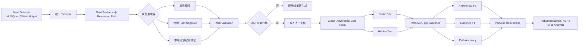
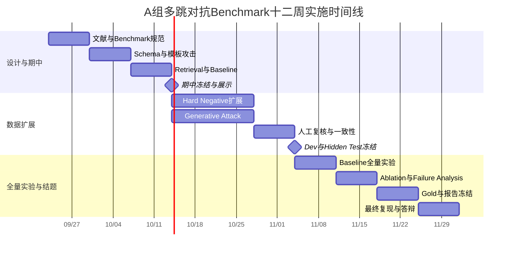

# 多跳问答与对抗鲁棒性深度研究：面向 A 组对抗 Benchmark 的文献综述、技术方案与三个月实施路线喵

## 执行摘要喵

本报告以截至 **2026 年 9 月** 的公开研究为范围，重点检索 2021–2026 年、尤其是 2023–2026 年的多跳问答（Multi-hop QA）、多步检索（Multi-step Retrieval）、RAG 鲁棒性、干扰证据与反事实噪声、自动多跳问题生成以及对抗评测研究，并优先采用 ACL Anthology、原始 arXiv 论文、官方 GitHub 仓库与原作者发布的数据资源作为依据喵。  

课程任务要求 A 组负责对抗任务、评测指标、数据采集、困难案例、认知陷阱、噪声与歧义样本的构建，并在多跳问答任务中特别加入冗余干扰文本、虚假中间线索、误导关联、歧义提问与反向推理，同时课程明确要求不能使用闭源大模型作为项目模型，可以部署 **30B 以下的开源模型**，因此下面的设计把这些条件作为硬约束，而不是可选项fileciteturn0file0喵。  

综合文献后，本报告最核心的判断是：**你们不应把项目做成“造一批很难的问题”，而应做成一个控制变量明确的 Pairwise Adversarial Multi-hop QA Benchmark，即每一个对抗样本尽可能对应一个语义目标、答案与 Gold Evidence 不变的 Clean 样本，然后只改变一个攻击因素，测量模型性能因攻击产生的因果性下降**喵。  
这一设计与 MuSiQue 对“真正连接的多跳推理”而非推理捷径的强调、Reasoning-Chain Attack 对指定推理跳进行攻击的思想、TASA 的 gold-answer-preserving attack、以及 RoMQA 对同类问题约束变化鲁棒性的测量逻辑高度一致citeturn14search2turn13academia36turn14search3turn14search1喵。  

从数据源上看，**MuSiQue 应作为首选 seed benchmark，2WikiMultiHopQA 与 HotpotQA 作为补充，MultiHop-RAG 作为跨文档 RAG 形式与检索评测参考**喵。  
MuSiQue 包含约 2.5 万个 2–4 跳问题，并通过自底向上的单跳问题组合与过滤降低“断连推理捷径”，官方还提供数据、模型与评测代码，因此特别适合你们从已有可靠多跳结构出发再构造对抗版本citeturn14search2turn17search3喵。  
MultiHop-RAG 则包含 2,556 个跨 2–4 个文档分布证据的查询，并同时提供检索与 QA 评测脚本，因此很适合借鉴“Retriever 与 Reader 分离评测”的工程设计citeturn17search0喵。  

对抗 taxonomy 建议分成两个层次，而不是简单放一个 `attack_type` 字段就结束喵。  
第一层是**攻击机制**，包括 Redundant Distractor、False Bridge、Misleading Relation、Entity Confusion、Partial Evidence、Counterfactual Conflict、Question Ambiguity、Reverse Reasoning 与 Combined Attack 喵。  
第二层是**攻击属性**，包括 target hop、攻击发生位置、干扰文档数量、语义相似度、实体重叠程度、答案泄漏程度和攻击强度喵。  
尤其值得优先实现的是 **False Bridge、Misleading Relation、Partial Evidence 与 Counterfactual Conflict**，因为近年的研究反复表明，模型不仅会被完全无关信息干扰，更容易受到“看起来相关但事实或关系错误”的上下文影响，而这恰恰比随机垃圾文本更能检验真正的多跳鲁棒性citeturn15search1turn13search1turn16search1喵。  

数据构建方面，最现实的组合不是只选一种生成方法，而是采用 **规则模板 → 检索式 hard-negative → 本地开源生成模型** 的三级流水线喵。  
规则方法负责高精度、高可控的数据骨架，检索式方法负责制造自然且与问题高度相似的现实干扰，开源生成模型负责补足反事实、歧义和复杂关系冲突，再通过自动约束和人工复核形成最终 Gold 数据喵。  
HopWeaver 在 2026 年进一步证明了从原始跨文档语料自动合成高质量多跳问题已经成为现实可行方向，而 GRADE、MultiHop-RAG 等工作也说明用结构化、多维方式控制推理与检索难度，比单纯增加问题数量更有评测价值citeturn13search10turn16search9turn17search0喵。  

模型方面，考虑课程的 `<30B` 限制与校内 GPU 数量**未指定**，我建议设三档 baseline 喵。  
最低资源档使用 **FLAN-T5-large + BM25/Elasticsearch**，中间主力档使用 **Qwen2.5-7B-Instruct + BM25/Dense Retrieval**，第二主力档使用 **Llama-3/3.1-8B-Instruct + 相同 Retriever**，并在主力模型上额外实现一个 IRCoT 式迭代检索版本喵。  
IRCoT 原论文同时在 HotpotQA、2WikiMultiHopQA、MuSiQue 和 IIRC 上实验，并报告检索最高提升 21 个点、下游 QA 最高提升 15 个点，而且明确验证过 FLAN-T5-large 这类较小模型，因此非常适合你们作为“强于 Vanilla RAG、但仍然可复现”的系统 baselineciteturn14search0turn17search1喵。  

三个月范围内，我建议最终目标不是“一万条机器生成题”，而是 **600–800 个 unique seed questions，形成约 800–1200 个经过人工验证的 Clean–Adversarial Pair，并覆盖至少五种核心攻击**喵。  
期中一个月目标则为 **300–500 个已验证 Pair、三类攻击、三套 baseline 运行成功、完整自动评测代码与可演示 Dashboard**喵。  
这个规模是项目规划建议而非文献给出的标准，但对四人小组来说，它能在数据量、人工质检、模型运行量和八页报告所需实验深度之间取得更合理的平衡喵。  

最重要的验收标准也不应该是“生成了多少条”，而应该是：**对抗样本 Gold Answer 不变率 ≥98%、Gold Evidence 保留率 ≥98%、抽样人类可回答率 ≥95%、双人标注一致性 Cohen’s κ 建议 ≥0.75，同时至少一个强 baseline 在对抗条件下出现统计显著且可解释的 Robustness Drop，而人类性能不能同步大幅下降**喵。  
若模型和人类同时大量答错，那通常说明你们造的是坏题而不是好攻击，哼，这个区别可千万别拖到答辩当天才发现喵。  

## 检索策略与研究版图喵

本次检索时间窗以 **2021 年至 2026 年 9 月** 为核心，并重点提高 2023–2026 年论文的权重，同时保留 HotpotQA、2WikiMultiHopQA 等时间较早但对证据标注和评测设计仍有基础意义的工作作为前置参考喵。  
直接针对“多跳问答 + 对抗鲁棒性”的论文数量实际上少于广义 RAG 鲁棒性、多步检索和自动多跳问题生成文献，因此检索时同时覆盖 Multi-hop QA、Multi-step Retrieval、RAG Robustness、Distractor、Counterfactual Noise、Reasoning Path 与 Question Generation 等相邻研究方向喵。  

**核心英文检索式**采用类似下面的组合喵。  

```text
("multi-hop question answering" OR "multi-step QA" OR "multi-hop retrieval")
AND
("adversarial" OR "robustness" OR "distractor" OR "counterfactual" OR "noise")

("multi-hop QA" OR "RAG")
AND
("reasoning path" OR "supporting facts" OR "evidence chain")

("multi-hop question generation" OR "multi-hop synthesis")
AND
("automatic" OR "benchmark" OR "difficulty")

("retrieval-augmented generation")
AND
("counterfactual noise" OR "misleading documents" OR "robustness")
```

中文检索则使用“多跳问答”“多步推理”“检索增强生成”“对抗鲁棒性”“干扰证据”“反事实噪声”“复杂问答数据集”“逻辑推理数据集”等关键词组合进行补充喵。  

来源优先级设定为 **ACL Anthology / ICLR 或会议官方页面 > 原始 arXiv > 作者或实验室官方 GitHub > 官方数据集仓库 > 其他聚合页面**喵。  
GitHub 只在确认它是论文作者或论文明确链接的仓库时作为复现依据，博客和二手介绍只适合发现关键词，不作为主要技术结论来源喵。  

纳入文献的核心条件是至少满足以下一个方向，即直接研究多跳 QA、明确研究 QA/RAG 的对抗或噪声鲁棒性、研究多跳检索与证据链、研究自动多跳数据生成，或提供适合本项目复用的数据与代码喵。  
纯粹针对通用 jailbreak、通用 prompt injection、与问答检索没有直接关系的攻击，以及只能调用闭源服务才能运行的方案，不作为你们课程项目的主要实现路线喵。  

近几年研究脉络相当清楚喵。  
2021–2022 年的研究重点之一是证明多跳 QA 模型会利用 shortcut，并开始从推理链的指定 hop 或答案句结构上构造攻击，而 MuSiQue 又进一步从数据构造阶段主动降低 disconnected reasoning shortcutciteturn13academia36turn14search3turn14search2喵。  
2023 年以后，研究重点开始从“有没有多跳推理”扩展到“如何进行迭代检索”“对不同约束变化是否稳定”以及“中间推理任务是否真的带来鲁棒性”，其中 IRCoT、RoMQA 与 Ho 等人的分析特别具有代表性citeturn14search0turn14search1turn13search7喵。  
2024 年则明显出现了 RAG 场景中的**反事实噪声、伪造文档、检索噪声与端到端攻击**研究，例如 MacNoise、ATM、TRACE、EfficientRAG 和 GARAG 分别从冲突文档、防御式训练、证据链构造、迭代检索和文本噪声攻击等角度研究系统脆弱性citeturn15search1turn15search5turn13search1turn15search4turn13search9喵。  
2025–2026 年进一步转向 graph-aware retrieval、动态搜索、长上下文鲁棒性和自动多跳 benchmark 合成，例如 HopRAG、Search-in-Context、HiGraAgent 与 HopWeaver 等工作，说明你们将“攻击路径结构”和“自动化数据构建”作为项目主线是相当贴近当前研究趋势的citeturn16search1turn16search0turn13search4turn13search10喵。  

直接适合作为主 seed 或评测参照的数据资源，可以概括为下表喵。  

| 数据集或资源 | 核心特点 | 对 A 组用途 | 推荐程度 |
|---|---|---|---|
| **MuSiQue** 喵 | 约 25K 个 2–4 hop 问题，自底向上组合单跳问题并抑制 shortcut，官方数据与评测代码完整citeturn14search2turn17search3喵 | 主 seed、hop 控制、证据链分析喵 | **最高喵** |
| **2WikiMultiHopQA** 喵 | 强调多跳证据与推理结构，长期被 IRCoT、EfficientRAG 等作为标准 benchmark 使用citeturn14search0turn15search4喵 | reasoning path 与跨实体关系设计喵 | **高喵** |
| **HotpotQA** 喵 | 拥有 supporting-facts 生态，是多跳 QA、对抗与检索方法最常见的实验基准之一citeturn13academia36turn14search0喵 | Evidence F1、bridge/comparison 题型与代码兼容喵 | **高喵** |
| **MultiHop-RAG** 喵 | 2,556 个 query，证据跨 2–4 文档，并提供 retrieval 与 QA 评测脚本citeturn17search0喵 | RAG 检索攻击、跨文档 hard negative 喵 | **高，建议外部评测喵** |
| **RoMQA** 喵 | 通过相关约束形成问题簇，强调 worst-case robustness，而不是只报告平均准确率citeturn14search1喵 | 借鉴 cluster robustness 与 worst-case 指标喵 | 中高喵 |
| **MacNoise** 喵 | 专门构造 conflict-induced、machine-generated counterfactual noise 数据citeturn15search1喵 | Counterfactual Conflict 攻击设计喵 | 高喵 |

中文资源方面，目前检索到的直接对应“开放域多跳 + 对抗鲁棒性 + 显式证据路径”的成熟 Benchmark 明显少于英文资源，因此我不建议为了中文而强行把主数据源换掉，这是根据当前检索结果做出的研究判断喵。  
更合适的方式是将中文作为 **P1 扩展子集**，而不是 P0 主线喵。  
例如 CLC-QuAD 包含 2.8 万余条中文 Wikidata 复杂问答并覆盖 multi-hop、dual-intent、Boolean 与 counting 类型，但它属于知识图谱语义解析范式，与基于原始文档证据的 A 组任务并不完全一致citeturn18search3喵。  
LogiQA2.0 则提供中英文逻辑推理数据和 baseline，但它主要是逻辑推理 MRC/NLI 而不是开放域多跳检索 QA，因此更适合借鉴“中文逻辑陷阱与干扰项设计”，不宜直接当成主 seedciteturn18search1喵。  
CDQA 的价值更多在动态数据、降低评测污染和半自动生成思路，而非多跳证据链本身citeturn18search0喵。  
另外，2026 年的中文 LLMEval-Logic 使用求解器验证和对抗强化来构造高难度逻辑题，对你们“自动验证 + 人工审校”的理念很有启发，但它仍然属于逻辑推理而非标准多跳检索 QAciteturn18academia36喵。  

## 推荐文献、数据集与开源实现喵

下面的“可复现性”是本报告基于是否存在官方数据、代码、评测脚本、依赖复杂度和硬件要求所做的项目级判断，而不是论文作者给出的评级喵。  
其中“高”表示大部分关键组件公开且课程小组可以合理复用，“中”表示存在部分资源但需要较多改造或硬件成本，“低”表示本次检索未确认完整官方实现或复现实验依赖较重喵。  

| 推荐文献 | 作者、年份与发表地 | 核心贡献 | 对 A 组 Benchmark 的直接价值 | 数据或代码 | 可复现性 |
|---|---|---|---|---|---|
| ⭐ **Reasoning Chain Based Adversarial Attack for Multi-hop Question Answering** citeturn13academia36喵 | Jiayu Ding、Siyuan Wang、Qin Chen、Zhongyu Wei，2021，CoRR/arXiv 喵 | 建模从 query entity 到 answer entity 的 reasoning chain，并允许选择某一 hop 定向攻击喵 | 直接支持 `target_hop`、Attack Position 与 Path Attack 的设计喵 | 本次检索未确认完整官方代码喵 | 中喵 |
| ⭐ **MuSiQue: Multihop Questions via Single-hop Question Composition** citeturn14search2turn17search3喵 | Harsh Trivedi、Niranjan Balasubramanian、Tushar Khot、Ashish Sabharwal，2022，TACL 喵 | 自底向上组合相互依赖的单跳问题，构造 25K 2–4 hop 数据并降低 shortcut 喵 | 最适合作为主 seed，并启发“先保证真多跳，再攻击”的原则喵 | 官方数据、评测、模型代码均有喵 | **高喵** |
| **TASA: Deceiving Question Answering Models by Twin Answer Sentences Attack** citeturn14search3喵 | Yu Cao、Dianqi Li、Meng Fang、Tianyi Zhou、Jun Gao、Yibing Zhan、Dacheng Tao，2022，EMNLP 喵 | 用 perturbed gold sentence 与 distracting answer sentence 同时降低正确答案置信度并诱导错误答案，同时保持 Gold Answer 喵 | 极适合学习“Answer-preserving 对抗上下文”的 QC 原则喵 | 有官方实现可获取，论文也给出完整方法喵 | 高喵 |
| ⭐ **Interleaving Retrieval with Chain-of-Thought Reasoning for Knowledge-Intensive Multi-Step Questions** citeturn14search0turn17search1喵 | Harsh Trivedi、Niranjan Balasubramanian、Tushar Khot、Ashish Sabharwal，2023，ACL 喵 | 将 CoT 推理步骤与 retrieval 交替执行，并在四个多步 QA 数据集上验证喵 | 最适合作为强 baseline 与“哪一 hop 检索失败”的分析参考喵 | 官方仓库含 processed data、retriever、FLAN-T5、评测与 reproduce 脚本喵 | **高喵** |
| **Analyzing the Effectiveness of the Underlying Reasoning Tasks in Multi-hop QA** citeturn13search7喵 | Xanh Ho、Anh-Khoa Duong Nguyen、Saku Sugawara、Akiko Aizawa，2023，Findings EACL 喵 | 发现 underlying reasoning task 能减少部分 shortcut，但并未自然提升对 sub-question 与 inverted-question 攻击的鲁棒性喵 | 强烈支持把 Reverse/Inverted Attack 单独作为攻击维度，而不能假设“会分解问题就是鲁棒”喵 | 论文资源明确，代码完整性本次未重点验证喵 | 中喵 |
| **RoMQA: A Benchmark for Robust, Multi-evidence, Multi-answer QA** citeturn14search1喵 | Victor Zhong、Weijia Shi、Wen-tau Yih、Luke Zettlemoyer，2023，Findings EMNLP 喵 | 通过约束变化形成相关问题簇，并用簇内 worst-case 表现评估 robustness 喵 | 可直接借鉴 Attack Cluster 与 Worst-case Score，而不是只看平均分喵 | 有研究仓库，但维护状态不如 MuSiQue/IRCoT 活跃喵 | 中喵 |
| ⭐ **MultiHop-RAG: Benchmarking Retrieval-Augmented Generation for Multi-Hop Queries** citeturn17search0喵 | Yixuan Tang、Yi Yang，2024，COLM 喵 | 建立证据跨 2–4 文档的 Multi-hop RAG Benchmark，并分离检索与 QA 评测喵 | 是你们设计 retrieval-level 与 reader-level 双层攻击评估的最好参考之一喵 | 官方仓库含数据、BM25、hybrid retrieval、QA 与 retrieval evaluator 喵 | **高喵** |
| **Why So Gullible? Enhancing Robustness against Counterfactual Noise** citeturn15search1喵 | Giwon Hong、Jeonghwan Kim、Junmo Kang、Sung-Hyon Myaeng、Joyce Jiyoung Whang，2024，Findings NAACL 喵 | 研究 relevant-but-false 文档造成的 knowledge conflict，并提供 MacNoise 喵 | 几乎直接对应你们的 Counterfactual Conflict、False Bridge 和 Misleading Relation 喵 | 数据公开情况较好，完整工程复现复杂度中等喵 | 中高喵 |
| **Evaluating Robustness of Generative Search Engine on Adversarial Factoid Questions** citeturn15search0喵 | Xuming Hu 等，2024，Findings ACL 喵 | 黑盒构造细微事实型 adversarial queries，评测生成式搜索/RAG 的事实脆弱性喵 | 可借鉴细粒度实体、时间、事实属性修改与人工有效性评价喵 | 论文声明数据与代码公开喵 | 中高喵 |
| **EfficientRAG: Efficient Retriever for Multi-Hop Question Answering** citeturn15search4turn17search2喵 | Ziyuan Zhuang 等，2024，EMNLP 喵 | 用轻量 Labeler/Filter 迭代生成下一跳 query 并滤除无关信息，减少每一步调用大型 LLM 的需求喵 | 可作为“过滤干扰文档能力”的强模型侧参照喵 | 官方 Microsoft 仓库、数据与训练代码可用喵 | 高，但完整训练数据生成成本偏高喵 |
| **TRACE the Evidence: Constructing Knowledge-Grounded Reasoning Chains for RAG** citeturn13search1喵 | Jinyuan Fang、Zaiqiao Meng、Craig MacDonald，2024，Findings EMNLP 喵 | 从检索文本构造 KG 和知识三元组 reasoning chains，在三个多跳数据集上报告最高约 14.03% 的平均增益喵 | 很适合定义结构化 Gold Path 与 Evidence Chain，而不是把自由文本 CoT 当 Gold 喵 | 有研究实现可用喵 | 高到中高喵 |
| **ATM: Adversarial Tuning Multi-agent System Makes a Robust RAG Generator** citeturn15search5喵 | Junda Zhu、Lingyong Yan、Haibo Shi、Dawei Yin、Lei Sha，2024，EMNLP 喵 | Attacker 与 Generator 对抗式迭代，训练模型识别噪声和伪造 retrieved documents 喵 | 可反向借鉴攻击生成 Agent 的 Prompt 与假证据类型喵 | ACL 页面提供数据附件，完整代码状况需另核验喵 | 中喵 |
| **Typos that Broke the RAG’s Back: GARAG** citeturn13search9喵 | Sukmin Cho、Soyeong Jeong、Jeongyeon Seo、Taeho Hwang、Jong C. Park，2024，Findings EMNLP 喵 | 使用遗传攻击模拟现实文档中的低层文本扰动，分析 retriever 与 generator 两端脆弱性喵 | 可扩展一个 P2 的 typo/noise attack，但不应成为主攻击类型喵 | 官方代码与 ACL software 包可用喵 | 高喵 |
| **Search-in-Context: Efficient Multi-Hop QA over Long Contexts via MCTS with Dynamic KV Retrieval** citeturn16search0喵 | Jiabei Chen、Guang Liu、Shizhu He、Kun Luo、Yao Xu、Jun Zhao、Kang Liu，2025，Findings ACL 喵 | MCTS + 动态 KV retrieval，并在多跳与 counterfactual 数据上测试喵 | 说明“长上下文 + 对抗噪声”最好联合评测，可作为期末高级分析参考喵 | 完整本地复现成本较高喵 | 中喵 |
| **HopRAG: Multi-Hop Reasoning for Logic-Aware RAG** citeturn16search1喵 | Hao Liu、Zhengren Wang、Xi Chen、Zhiyu Li、Feiyu Xiong、Qinhan Yu、Wentao Zhang，2025，Findings ACL 喵 | 用 passage graph 和 pseudo-query 建逻辑边，再 retrieve-reason-prune 喵 | 对“检索式 hard distractor”极有启发，因为攻击最好针对逻辑相关而不仅语义相似喵 | 本次检索未确认低成本完整 reproduction 配置喵 | 中喵 |
| **Robust Knowledge Editing via Explicit Reasoning Chains for Distractor-Resilient Multi-Hop QA** citeturn16search6喵 | Yuchen Wu、Liang Ding、Li Shen、Dacheng Tao，2025，Findings EMNLP 喵 | 在 MQuAKE-CF 干扰条件下显式判断事实相关性，并报告 Qwen2.5-7B 在 heavy distraction 下较小性能下降喵 | 可用于判断你们攻击是否覆盖当前“小模型显式过滤干扰”能力喵 | 论文称代码将发布，本次检索未确认最终仓库状态喵 | 中喵 |
| **HiGraAgent: Dual-Agent Adaptive Reasoning over Hierarchical KG for Open-Domain MHQA** citeturn13search4喵 | Hung Luu、Long S. T. Nguyen、Trung Pham、Hieu Pham、Tho Quan，2026，Findings EACL 喵 | 通过层次知识图和双 Agent 自适应检索推理，并在 HotpotQA、2Wiki、MuSiQue 上报告较强结果喵 | 可作为未来强系统是否仍被你们 Benchmark 击穿的研究参照，但不建议四人小组完整复现喵 | 资源需求与系统复杂度较高喵 | 中低到中喵 |
| ⭐ **HopWeaver: Cross-Document Synthesis of High-Quality and Authentic Multi-Hop Questions** citeturn13search10喵 | Zhiyu Shen、Jiyuan Liu、Yunhe Pang、Yanghui Rao、Fu Lee Wang、Jianxing Yu，2026，ACL 喵 | 自动从跨文档原始语料合成高质量多跳问题，并强调比人工标注更低成本的自动 benchmark 构建喵 | 是你们“生成式数据扩展”最值得阅读的最新论文之一喵 | 论文方法清晰，完整项目复现难度中等喵 | 中喵 |

**建议的优先阅读顺序**是 MuSiQue → Reasoning Chain Attack → MultiHop-RAG → IRCoT → HopWeaver，然后补 TASA、Why So Gullible 与 TRACE 喵。  
前五篇分别解决“真多跳数据如何构造”“如何攻击指定 hop”“RAG 怎样分层评测”“强 baseline 怎样做迭代推理”“如何自动扩展多跳数据”这五个最贴近你们项目的问题喵。  

可直接复用的开源仓库中，最值得下载的是 **StonyBrookNLP/musique**，因为包含数据、官方评测代码和论文模型citeturn17search3喵。  
第二个应下载 **StonyBrookNLP/ircot**，其仓库不仅有 `reproduce.sh`，还已经统一处理 HotpotQA、2Wiki、MuSiQue 与 IIRC，并带 retriever server、metrics、prompt 与 FLAN-T5 配置，这可以省掉你们大量基础工程时间citeturn17search1喵。  
第三个是 **yixuantt/MultiHop-RAG**，仓库直接包含 `bm25_retrieval.py`、`hybrid_retriever.py`、`retrieval_evaluate.py` 与 `qa_evaluate.py` 等组件，非常适合拆着看代码结构citeturn17search0喵。  
第四个是 **microsoft/EfficientRAG**，适合参考下一跳 query 生成与 irrelevant filtering，但官方完整数据构建流程曾使用 LLaMA-3-70B-Instruct，因此你们不能照搬其完整训练管线作为课程执行方案，而应只复用思想或已公开的中间数据citeturn17search2喵。  
另外，2026 ICLR Oral 的 **Q-RAG** 官方仓库报告其 retrieval agent 可在单张 A100 上训练，并提供 HotpotQA/MuSiQue 代码，但其论文的某些 open-domain QA 配置使用 QwQ-32B reader，这超过课程 `<30B` 限制，因此可以阅读 retrieval 方法，不能原样作为课程 baselineciteturn18search7喵。  

## A 组 Benchmark 设计审计与推荐方案喵

你们原先提出的 Clean–Adversarial Pair、攻击 taxonomy、JSON schema、Evidence/Path 指标、Public Dev + Hidden Test 等方向总体判断是 **技术上可行，而且研究设计是对的**喵。  
真正需要升级的地方，是把这些点从“功能列表”变成一个有统计含义的 benchmark protocol 喵。  

| 设计项 | 可行性 | 主要技术难点 | 最大风险 | 缓解措施 | 预计资源 | 优先级 |
|---|---|---|---|---|---|---|
| **Clean–Adversarial Pair** 喵 | 很高喵 | 保证 Attack 后 Gold Answer 与 Gold Evidence 仍有效喵 | 攻击其实改变了题意，使性能下降失去解释性喵 | `pair_id` 强绑定、自动 invariance check、双人复核、保留原 Gold Evidence 喵 | 4 人共同 QC，CPU 即可喵 | **P0喵** |
| **Attack Taxonomy** 喵 | 很高喵 | 各攻击类型容易重叠喵 | 标签混乱导致最终分析无法解释喵 | `primary_type + secondary_tags + target_hop + severity`，不要强迫单标签表示全部属性喵 | 第 1–2 周集中设计喵 | **P0喵** |
| **Reasoning Path Schema** 喵 | 高喵 | 一题可能存在多个合法推理路径喵 | Strict Path Accuracy 错杀语义等价路径喵 | Gold path 用实体/关系/证据 ID 结构化表示，同时允许 `alternative_paths` 与 Edge F1 喵 | 人工 path 校验是主要成本喵 | **P0喵** |
| **Evidence F1 + Path Accuracy** 喵 | 高喵 | 生成式模型未必天然输出证据 ID 喵 | 答案对但证据是编的，或证据对但格式不一致喵 | 要求模型输出固定 JSON，并将 answer/evidence/path 分开评分喵 | 几天工程开发喵 | **P0喵** |
| **Public Dev + Hidden Test** 喵 | 很高喵 | 防止 B 组从公开样本反推 hidden 样本喵 | Seed、实体或同一文档泄漏导致 test 形同 dev 喵 | **先按 seed/document/entity cluster 划分，再生成攻击**，禁止 pair-level 随机切分喵 | 几乎不耗 GPU，主要是 split 脚本喵 | **P0喵** |
| **检索/Reader 分离评测** 喵 | 很高喵 | 需要统一 passage ID 与 corpus 索引喵 | 不知道到底是检索失败还是推理失败喵 | 同时报告 Recall@k 与 Gold-context QA，两阶段隔离喵 | Elasticsearch/FAISS + 模型推理喵 | **P0喵** |
| **自动攻击生成** 喵 | 高喵 | 自动生成容易制造不可回答或多答案问题喵 | 数据数量多但 Gold 不可信喵 | 三级生成 + 自动 QC + 人工 adjudication 喵 | 最主要人力开销喵 | **P0/P1喵** |
| **Combined Attack** 喵 | 中高喵 | 因果归因困难喵 | 最终只知道组合很难，不知道为什么难喵 | 前期只做 single-factor，期末再组合两类已验证攻击喵 | 第 9 周以后喵 | P2喵 |
| **中文扩展集** 喵 | 中喵 | 翻译会引入额外语言变量喵 | 将语言难度误认为对抗鲁棒性喵 | 单独作为 Chinese Extension，不与英文主结果混合喵 | 额外人工复核喵 | P1/P2喵 |

最重要的改进是把 **Clean–Adversarial Pair 再细分为 Context Attack Pair 与 Query Attack Pair** 喵。  
对于冗余文本、False Bridge、Misleading Relation、Partial Evidence 和 Counterfactual Conflict，最好坚持严格定义，即 **Question、Gold Answer、Gold Evidence Path 全部保持不变，只改变非 Gold Context** 喵。  
这种 pair 最接近真正的控制变量实验，而 TASA 与早期 reasoning-chain adversarial attack 的核心思想也都是在尽量保持原任务有效性的同时添加或修改攻击因素citeturn14search3turn13academia36喵。  

Ambiguity 与 Reverse Reasoning 则比较特殊，因为它们往往涉及问题本身重写喵。  
因此建议将其归到 **Semantic-Preserving Query Attack**，要求语义目标与答案保持等价，但不要把这类攻击和纯 context-only attack 混为一个总体 RobustnessDrop，否则解释会变得不干净喵。  

推荐 taxonomy 如下喵。  

| 一级攻击类型 | 核心机制 | 是否严格保持 Question | 最适合攻击位置 | 推荐优先级 |
|---|---|---:|---|---|
| **Redundant Distractor** 喵 | 加入主题相关但对答案无用的信息喵 | 是喵 | 全局 Context 喵 | P0喵 |
| **False Bridge** 喵 | 构造错误中间实体 `X'`，形成貌似完整的替代路径喵 | 是喵 | Hop 1 或 Hop 2 喵 | **P0+喵** |
| **Misleading Relation** 喵 | 实体正确但关系被替换，例如“出生于”变成“工作于”喵 | 是喵 | 任意 Relation Edge 喵 | **P0+喵** |
| **Partial Evidence** 喵 | 假路径的一部分完全正确，后一跳才出错喵 | 是喵 | 中间 hop 喵 | **P0+喵** |
| **Counterfactual Conflict** 喵 | 插入与真实证据直接冲突且高度相关的假信息喵 | 是喵 | Gold Evidence 附近喵 | P1喵 |
| **Entity Confusion** 喵 | 同名、近名、同职业或强语义相似实体替换喵 | 是喵 | Bridge Entity 喵 | P1喵 |
| **Question Ambiguity** 喵 | 指代、范围、比较对象或限定词制造歧义喵 | 否，语义等价改写喵 | Query 喵 | P1喵 |
| **Reverse Reasoning** 喵 | 改变推理方向或要求逆关系寻找实体喵 | 否或部分否喵 | Relation Path 喵 | P1喵 |
| **Combined Attack** 喵 | 同时组合两种经过独立验证的攻击喵 | 视组合而定喵 | 多处喵 | P2喵 |

False Bridge 不应该只是“随便加一个错误人名”喵。  
理想的 False Bridge 应满足四个条件，即对问题具有较高 lexical/semantic relevance、至少与 Gold Path 共享一个实体或关系模式、能够构成完整但错误的替代路径，并且不意外形成第二个正确答案喵。  
Hong 等人关于 counterfactual noise 的研究恰好指出，比完全无关文档更危险的是“被检索器判定为相关、但含有误导性或错误信息”的文档，因此你们应该把 hard distractor 的“相关但错误”作为质量标准，而不是仅仅把 irrelevant text 数量堆高citeturn15search1喵。  

Difficulty 也不建议只用 `easy/medium/hard` 人工拍脑袋标记喵。  
可以将难度定义为至少四个可计算变量，即 `hop_count`、`semantic_similarity_to_gold`、`entity_overlap` 和 `num_distractors`，再加一个 `attack_strength` 人工等级喵。  
GRADE 在 2025 年提出将 reasoning depth 与 query-support semantic distance 作为两个正交维度构造 difficulty matrix，这个思想与你们的 Benchmark 特别契合citeturn16search9喵。  

**Public Dev + Hidden Test** 建议按 seed 先拆分，再生成全部 pair 喵。  
也就是说，`seed_001` 的 Clean、False Bridge、Redundant、Counterfactual 等所有变体必须全部属于同一个 split，不能有一个出现在 dev、另一个出现在 hidden test 喵。  
进一步还建议按照文档簇或核心实体做 group split，使 Hidden Test 尽可能减少与 Dev 的实体级近重复喵。  
对于最终约 600–800 个 unique seeds，可以建议约 **35% Public Dev、65% Hidden Test**，这是课程项目规划比例而不是某个 benchmark 的硬性标准喵。  

更进一步，可以让 Hidden Test 中约 20% 的问题使用**公开 taxonomy 但未公开具体模板参数**的 attack realization 喵。  
B 组知道“会考 False Bridge”，但不知道假 bridge 是怎样选出来的，这样才能区分“针对模板调参”和真正的 robustness improvement 喵。  

数据统计时必须以 **seed_id 为统计重采样单位**，而不是把同一个 seed 的五个 adversarial variants 当成五个完全独立问题喵。  
否则一个特别脆弱的 seed 被扩增五次，会让置信区间显得比真实情况更窄喵。  
最终所有均值建议同时报告 paired bootstrap 95% CI，并按 attack type、hop count 和 target hop 分层展示喵。  

你们四个人的分工最好采用“主责 + 交叉复核”喵。  

| 成员 | 主责模块 | 次责与交叉职责 | 期中前核心产出 |
|---|---|---|---|
| A 喵 | Benchmark Lead、taxonomy、schema、split protocol 喵 | 报告主笔、Hidden Test 管理喵 | `benchmark_spec_v1.md`、schema、标注规范喵 |
| B 喵 | Rule + Retrieval Attack Pipeline 喵 | 数据索引、自动验证喵 | 两种攻击生成器与至少 150 个候选 Pair 喵 |
| C 喵 | Generative Attack + Human QC 喵 | 中文扩展、标注一致性喵 | Generative prototype、审核表与 κ 统计喵 |
| D 喵 | Baseline + Evaluation + Demo 喵 | 图表、实验日志喵 | 三个 baseline smoke test、指标脚本与 Streamlit 喵 |

所有成员都应承担 Gold 审核，建议采用“生成者不能单独批准自己生成的数据”的原则喵。  
每条最终 hidden Gold 至少由一人生成、一人复核，抽取约 15–20% 再进行第三人 adjudication，这会让报告中的 Quality Control 真正具有可信度喵。  

## 对抗样本生成、数据格式与 Clean–Adversarial 示例喵

最实际的系统不是在三种自动生成方法里三选一，而是让三者负责不同数据分布喵。  
规则模板保证 precision，retrieval-based 方法保证 naturalness 与 realistic hardness，生成模型负责长尾与高复杂度攻击喵。  

**方法 A：规则化模板攻击喵**  

算法步骤是先读取 Gold Reasoning Path，再选择目标 hop，根据关系类型调用特定 transformation，构造错误中间实体或错误关系句，最后将其放入非 Gold 文档或 Gold 邻近位置喵。  
例如正确关系是 `人物 → 出生于 → 城市`，可以从实体属性表中选择同一个人的“工作城市”“毕业城市”等作为关系近邻，再构造与问题关键词高度重叠但事实目标错误的 distracting sentence 喵。  

```python
def template_attack(seed, attack_type, rng):
    path = seed.reasoning_path
    hop = choose_target_hop(path, rng)

    if attack_type == "false_bridge":
        distractor = make_false_bridge(path[hop], seed, rng)
    elif attack_type == "misleading_relation":
        distractor = swap_relation(path[hop], seed, rng)
    elif attack_type == "entity_confusion":
        distractor = replace_with_confusable_entity(path[hop], seed, rng)
    else:
        raise UnsupportedAttack()

    candidate = insert_non_gold_evidence(seed, distractor)
    return candidate
```

它的优势是 determinism 强、容易定位攻击位置、生成速度快、方便 debug 与消融实验，而且最适合作为期中阶段的第一批 Gold 数据喵。  
缺点是语言模式可能过于模板化，模型可能学会识别某些固定句式而不是增强真正推理能力喵。  

自动 QC 至少检查 `gold_answer unchanged`、所有原 Supporting Facts 仍存在、攻击文档没有直接包含 Gold Answer、错误 bridge 没有与 Gold Path 合并形成另一个正确答案，以及文本长度和格式是否合法喵。  
建议再加一个 retrieval-hardness 检查，即新 distractor 必须进入 BM25 或 dense retriever 的 Top-k，否则它虽然逻辑上是攻击，实际模型根本看不到喵。  

以 1000 个 adversarial candidate 估算，规则攻击通过自动检查后每条人工复核约 **1–2 分钟**是比较现实的项目规划值，对应约 17–33 人时喵。  
这是本项目的工作量估算，不是文献测量结果喵。  

**方法 B：基于检索的 Hard Distractor 插入喵**  

这种方法最值得作为你们的主力喵。  
先用 seed question、bridge entity 或某一 hop 的中间 query 去 BM25 或 dense index 检索 Top-k，然后排除 Gold Documents，再根据 shared entity、semantic similarity、relation mismatch、answer leakage 等规则重新打分，从中选择“最像 Gold、但实际上不支持答案”的文档喵。  
HopRAG 的核心观察之一正是纯 lexical/semantic similarity 不等于 logical relevance，而 MultiHop-RAG 与 IRCoT 又提供了完整的检索评测框架，因此你们从检索阶段主动寻找 hard negative 非常合理citeturn16search1turn17search0turn14search0喵。  

```python
def retrieval_attack(seed, index, k=50):
    query = build_hop_query(seed.question, seed.reasoning_path)
    candidates = index.search(query, top_k=k)

    candidates = [
        d for d in candidates
        if d.doc_id not in seed.gold_doc_ids
        and not leaks_gold_answer(d, seed.answer)
    ]

    for d in candidates:
        d.hardness = (
            semantic_similarity(d, seed) +
            entity_overlap(d, seed) +
            relation_confusability(d, seed) -
            alternate_proof_score(d, seed)
        )

    distractor = max(candidates, key=lambda x: x.hardness)
    return insert_document(seed, distractor)
```

最大优点是干扰文本来自真实语料，因此语言自然性高，也更接近真实 RAG 系统面临的检索误差喵。  
另一个重要优点是可以同时攻击 Retriever 与 Reader，并分析“是否先被检索到”“被检索后是否真的骗过模型”这两个阶段喵。  

风险是某个检索出的“负例”可能实际上存在未标注的第二条正确路径，所以必须做 Alternate Proof 检查喵。  
自动检查可以采用实体关系图搜索、answer string 检测、Gold Relation blacklist 与另一个 verifier model 的 entailment/relevance 判断，但最终仍建议人工读一遍 hard negative 喵。  

这一类样本人工审核通常应预算得更高，项目上建议按每条约 **2–3 分钟**预留，对 1000 个候选约为 33–50 人时喵。  
你们可以让它只占最终 Gold 的约 40–50%，而不是 100% 全部人工重审同一种攻击喵。  

**方法 C：基于本地开放权重生成模型的对抗生成喵**  

第三种方法由 `<30B` 的本地模型接收 question、Gold Path、Gold Facts 与指定 attack specification，再只生成 distractor，不让模型重新决定 Gold Answer 喵。  
这是非常关键的约束，因为让一个生成模型同时“写问题、写证据、写答案、自己判断是否正确”会形成典型的 self-validation failure 喵。  
课程还明确禁止把闭源大模型作为执行模型，因此生成器应使用允许本地部署且不超过 30B 的模型，并在报告中记录 model_id、revision、prompt_version 与 sampling configfileciteturn0file0喵。  

建议 prompt 输出严格 JSON，而不是自由文本喵。  

```python
def generative_attack(seed, local_model, attack_spec):
    prompt = build_structured_prompt(
        question=seed.question,
        gold_answer=seed.answer,
        gold_path=seed.reasoning_path,
        gold_evidence=seed.supporting_facts,
        attack_type=attack_spec.type,
        target_hop=attack_spec.target_hop,
        constraints=[
            "do_not_change_gold_answer",
            "do_not_remove_gold_evidence",
            "generate_only_distractor",
            "return_json"
        ]
    )

    proposals = local_model.generate(prompt, n=4)

    valid = []
    for p in proposals:
        if schema_valid(p) and invariance_check(seed, p):
            valid.append(p)

    return rank_by_adversarial_hardness(valid)
```

生成式方法最适合 False Bridge、Counterfactual Conflict、Ambiguity 与 Combined Attack，因为这些类型很难仅靠字符串模板得到自然、复杂的文本喵。  
HopWeaver 2026 展示了跨文档自动合成高质量多跳问题的可行性，而 2024–2026 年越来越多工作也开始自动合成或自动标注 reasoning trajectories，这说明生成模型可以成为数据扩展工具，但不等于可以取消人工审核citeturn13search10turn16search0喵。  

这类数据最大风险是事实幻觉和隐式改变 Gold semantics 喵。  
所以推荐的验证链是 `JSON Schema → Gold Evidence Preservation → Answer Leakage → NLI/Entailment → Alternate Proof → Retriever Hardness → Human Review` 喵。  
人工预算建议按 **3–5 分钟/最终候选**计算，因此 1000 条可能需要约 50–83 人时，最好只让 generative attack 占最终数据的 20–30% 喵。  

三种方法综合起来，建议最终数据配比约为 **规则法 30%、检索 hard-negative 45%、生成式 25%**，这是针对四人课程项目的资源配置建议喵。  
中后期还可以增加一个效果通常更好的 hybrid，即先 Retrieval 找到自然实体/事实素材，再让本地模型只负责 rewrite 成 False Bridge，而不是让模型从零虚构全部内容喵。  

完整数据生成与评测流程建议如下喵。  



JSONL 的 schema 不要只存 `question/answer/context`，否则最后很多想做的分析都会因为缺字段被迫重新标注喵。  
同时又不能把 schema 做成五十个强制字段，否则第一个月会全耗在填表上喵。  

| 字段 | 类型 | 是否核心 | 含义 |
|---|---|---:|---|
| `id` 喵 | string 喵 | 是喵 | 当前具体 variant 唯一 ID 喵 |
| `pair_id` 喵 | string 喵 | 是喵 | Clean 与 Adversarial 的配对 ID 喵 |
| `seed_id` 喵 | string 喵 | 是喵 | 原始 seed question ID，用于 split 和 bootstrap 喵 |
| `split` 喵 | enum 喵 | 是喵 | `dev_public` 或 `test_hidden` 喵 |
| `variant` 喵 | enum 喵 | 是喵 | `clean` / `adversarial` 喵 |
| `language` 喵 | string 喵 | 是喵 | `en` / `zh` 喵 |
| `source_dataset` 喵 | string 喵 | 是喵 | MuSiQue、2Wiki、Hotpot 等喵 |
| `question` 喵 | string 喵 | 是喵 | 当前问题喵 |
| `answer.text` 喵 | string 喵 | 是喵 | Gold Answer 喵 |
| `answer.aliases` 喵 | list 喵 | 推荐喵 | 可接受别名，解决 EM 过严问题喵 |
| `documents` 喵 | list<object> 喵 | 是喵 | 文档及 `doc_id/title/text/is_gold/is_distractor` 喵 |
| `supporting_facts` 喵 | list<object> 喵 | 是喵 | Gold `doc_id + sent_id` 喵 |
| `reasoning_path` 喵 | list<object> 喵 | 是喵 | 结构化 `head-relation-tail-evidence` hop 喵 |
| `alternative_paths` 喵 | list 喵 | 可选喵 | 多个合法 Gold Path 喵 |
| `hop_count` 喵 | int 喵 | 是喵 | 2/3/4 等喵 |
| `attack.primary_type` 喵 | enum 喵 | 对抗样本必需喵 | False Bridge 等喵 |
| `attack.secondary_tags` 喵 | list 喵 | 推荐喵 | Entity Confusion 等辅助标签喵 |
| `attack.target_hop` 喵 | int/null 喵 | 推荐喵 | 被攻击 hop 喵 |
| `attack.source_method` 喵 | enum 喵 | 是喵 | template/retrieval/generative 喵 |
| `attack.severity` 喵 | int 喵 | 推荐喵 | 1–3 喵 |
| `provenance` 喵 | object 喵 | 是喵 | 原数据 ID、许可证、生成版本等喵 |
| `qc` 喵 | object 喵 | 是喵 | 自动验证、人工标签、复核者与 adjudication 喵 |

建议的真实 JSONL 记录可以长成这样喵。  

```json
{
  "id": "A_MHQA_0001_ADV_FB",
  "pair_id": "A_MHQA_0001_FB",
  "seed_id": "A_MHQA_0001",
  "split": "dev_public",
  "variant": "adversarial",
  "language": "zh",
  "source_dataset": "internal_synthetic",
  "question": "获得青杉奖的电影《远岚》的导演出生国首都是哪里？",
  "answer": {
    "text": "云京",
    "aliases": ["云京市"]
  },
  "documents": [
    {
      "doc_id": "d1",
      "text": "《远岚》的导演是林牧。",
      "is_gold": true,
      "is_distractor": false
    },
    {
      "doc_id": "d2",
      "text": "林牧出生于北澜国。",
      "is_gold": true,
      "is_distractor": false
    },
    {
      "doc_id": "d3",
      "text": "北澜国的首都是云京。",
      "is_gold": true,
      "is_distractor": false
    },
    {
      "doc_id": "d4",
      "text": "同名导演林牧曾长期居住于南泽国，南泽国首都是海临。",
      "is_gold": false,
      "is_distractor": true
    }
  ],
  "supporting_facts": [
    {"doc_id": "d1", "sent_id": 0},
    {"doc_id": "d2", "sent_id": 0},
    {"doc_id": "d3", "sent_id": 0}
  ],
  "reasoning_path": [
    {"hop": 1, "head": "远岚", "relation": "导演", "tail": "林牧", "evidence": "d1"},
    {"hop": 2, "head": "林牧", "relation": "出生国", "tail": "北澜国", "evidence": "d2"},
    {"hop": 3, "head": "北澜国", "relation": "首都", "tail": "云京", "evidence": "d3"}
  ],
  "attack": {
    "primary_type": "false_bridge",
    "secondary_tags": ["entity_confusion"],
    "target_hop": 2,
    "source_method": "retrieval",
    "severity": 2
  },
  "qc": {
    "answer_invariant": true,
    "gold_evidence_preserved": true,
    "alternate_answer_found": false,
    "human_verified": true
  }
}
```

特别建议**不要把模型自由生成的长篇 Chain-of-Thought 当作唯一 Gold Path**喵。  
你们需要标注的是可审计的实体、关系和证据边，例如 `A → relation → B → relation → C`，因为 TRACE 这类研究也更强调知识 grounding 与 reasoning chain 的结构对应，而不是相信一段生成式自然语言理由一定忠实反映模型内部推理citeturn13search1喵。  

下面五组是专门用于理解数据设计的**虚构教学样例**，其中实体和事实都是人为构造的，不对应现实世界，因此不会混入事实错误问题喵。  

| Pair | Clean | Adversarial | 攻击点 | Gold 是否变化 |
|---|---|---|---|---|
| **样例 A 喵** | 问题为“电影《远岚》的导演出生国首都是哪里”，证据为《远岚》→林牧→北澜国→云京喵 | 加入“同名导演林牧长期居住南泽国，南泽国首都是海临”喵 | **False Bridge + Entity Confusion**，诱导 `林牧→南泽国→海临` 喵 | 不变，仍为云京喵 |
| **样例 B 喵** | 问题为“星河出版社创始人的出生国首都是哪里”，Gold 证据指出创始人顾川出生于玄洲国，首都清原喵 | 加入“顾川在东岭国工作二十年，东岭国首都桐城”喵 | **Misleading Relation**，把工作国当出生国喵 | 不变，仍为清原喵 |
| **样例 C 喵** | 问题需经 `海岳大学→校长赵明→本科院校青川大学→所在城市岚城` 得到答案喵 | 干扰证据正确写“赵明本科毕业于青川大学”，但下一句错误写“青川大学位于泽城”喵 | **Partial Evidence**，第一段假链正确、最后一步错误喵 | 不变，仍为岚城喵 |
| **样例 D 喵** | 问题“获星云奖小说的作者出生地所属国家首都是哪里”，两跳证据唯一确定作者与国家喵 | 加入另一名同姓作者及高度相似作品名，同时两人均与“星云文学节”相关喵 | **Entity Confusion + Redundant Distractor** 喵 | 不变喵 |
| **样例 E 喵** | Clean 问“哪所大学位于作家周岚出生城市”，路径为周岚→出生于青屿→青屿大学喵 | Query 改写为“青屿大学所在城市是哪位作家的出生地”，并加入另一位在青屿工作的作家信息喵 | **Reverse Reasoning + Ambiguity** 喵 | 语义目标保持等价，但属于 Query Attack，需单独统计喵 |

这些例子还说明一个细节喵。  
**False Bridge 的错误答案最好能够通过一条完整、表面合理的链得到，而不是仅仅在上下文里凭空出现一个错误答案字符串**喵。  
否则测到的更多是模型会不会做关键词匹配，而不是它在两个 competing reasoning paths 之间能否选对路径喵。  

## Baseline、评测框架与可复用工程实现喵

考虑课程限制、团队规模与“GPU 数量未指定”，最稳妥的做法是先锁定三个参数量差异明显、工程复杂度可控的 Reader baseline，再为其中一个 7B/8B 模型实现 Vanilla RAG 与 IRCoT-style RAG 两种检索策略喵。  

| Baseline | 用途 | 推荐配置 | 资源规划估算 | 价值 |
|---|---|---|---|---|
| **FLAN-T5-large** 喵 | 低资源对照、IRCoT reproduction 喵 | FP16/BF16，temperature=0，BM25 Top-k + direct QA / IRCoT 喵 | 通常单张中低显存 GPU 即可，具体校内 GPU **未指定**喵 | IRCoT 原工作明确验证过 FLAN-T5-large，因此是最可靠的小模型 baselineciteturn14search0turn17search1喵 |
| **Qwen2.5-7B-Instruct** 喵 | 中英文主 baseline 喵 | BF16 若显存允许，否则 4-bit，temperature=0，max_new_tokens 控制在 128–256 喵 | 建议 24GB GPU，若不足则量化推理，此处为规划估算喵 | 7B 级模型足够强又明显低于 30B 限制，而且已有 2025 distractor-resilient MHQA 工作以其为实验模型citeturn16search6喵 |
| **Llama-3/3.1-8B-Instruct** 喵 | 第二模型家族，验证攻击是否跨模型迁移喵 | 与 Qwen 完全相同 Prompt、Top-k 与 decoding，避免人为偏置喵 | 24GB 档建议，4-bit 可进一步降低资源需求，此处为规划估算喵 | EfficientRAG 官方实现明确采用 LLaMA-3-8B-Instruct 作为生成器，因此工程生态成熟citeturn17search2喵 |
| **Qwen/Llama + IRCoT-style Retrieval** 喵 | 强系统级 baseline 喵 | 每 hop 检索 Top-k=5 左右，最多 2–4 hops，最终统一 Reader 喵 | 检索调用数增多，但无需训练大模型喵 | 能区分“Direct RAG 被攻击”与“迭代检索是否真正提高鲁棒性”喵 |

这里不建议你们直接把某篇论文排行榜数字当成“本项目预期准确率”，因为 corpus、prompt、retriever、上下文长度与 evaluation normalization 任一项不同都可能造成相当大的差距喵。  
IRCoT 官方仓库甚至特别提醒其超参数选择在部分实验中会导致超过 20 个点的差异，因此你们应该把公开论文结果当 sanity reference，而不是验收线citeturn17search1喵。  

更加合理的项目目标，是在 Pilot Set 上先校准攻击强度喵。  
我建议 strong baseline 的 Clean Accuracy/F1 达到可用水平以后，将攻击设计校准到 **Answer RobustnessDrop 大约 10–30 个百分点或 ASR 约 20–50% 的区间**，同时人类准确率相较 Clean 下降不超过约 5 个百分点喵。  
这两个区间是为了项目实验具有区分度而提出的**验收建议**，不是文献所声称的普适规律喵。  

模型需要统一输出类似下面的结构化预测喵。  

```json
{
  "answer": "云京",
  "evidence": [
    ["d1", 0],
    ["d2", 0],
    ["d3", 0]
  ],
  "path": [
    ["远岚", "导演", "林牧"],
    ["林牧", "出生国", "北澜国"],
    ["北澜国", "首都", "云京"]
  ]
}
```

**Answer EM 与 Answer F1** 应沿用标准 QA normalization 思路，包括大小写、标点、冠词或中英文空白标准化，并允许 `answer.aliases` 喵。  
MuSiQue 官方仓库本身就提供现成评测脚本，因此可以先直接复现其处理方式，再包一层你们自己的统一 evaluator，而不是从零凭感觉写字符串比较citeturn17search3喵。  

**Evidence F1** 推荐定义为句级 Supporting Fact 集合的精确率、召回率与 F1 喵。  

\[
P_E=\frac{|E_{pred}\cap E_{gold}|}{|E_{pred}|}
\]

\[
R_E=\frac{|E_{pred}\cap E_{gold}|}{|E_{gold}|}
\]

\[
F1_E=\frac{2P_ER_E}{P_E+R_E}
\]

其中 Evidence 单位应该是 `(doc_id, sent_id)`，而不是整篇文档是否命中喵。  
这样能避免模型只要把全部文档都宣称为证据就轻松取得高 recall 喵。  

**Path Accuracy** 建议同时给 Strict 与 Soft 两种喵。  

\[
PathAcc_{strict}
=
\mathbf 1[\operatorname{normalize}(P_{pred})\in P_{gold}^{valid}]
\]

如果存在多个合法 Gold Path，则预测命中任意一个都算对喵。  

再定义基于有向边的 Path Edge F1 喵。  

\[
P_{path}
=
\frac{|Edges_{pred}\cap Edges_{gold}|}{|Edges_{pred}|}
\]

这样模型即使最后一步错误，也能区分“整条链乱猜”和“前三跳正确、最后一跳被 False Bridge 劫持”喵。  

你们最核心的 paired metric 是 **RobustnessDrop** 喵。  

\[
RobustnessDrop
=
Score_{clean}-Score_{adv}
\]

报告时使用百分点，例如 Clean EM 62.3%、Adversarial EM 41.8%，则 Drop 为 **20.5 pp**，不要写成“下降 20.5%”导致相对百分比和百分点混淆喵。  

另外建议同时提供 Relative Robustness Drop 喵。  

\[
RelativeDrop=
\frac{Score_{clean}-Score_{adv}}
{Score_{clean}}
\]

**Attack Success Rate** 则只统计 Clean 原本能够答对的 pair 喵。  

\[
ASR=
\frac
{\sum_i\mathbf1(C_i=1\land A_i=0)}
{\sum_i\mathbf1(C_i=1)}
\]

这里 `C_i=1` 表示 Clean 正确，`A_i=0` 表示其对应 Adversarial 版本错误喵。  
ASR 比单纯 Adversarial Accuracy 更适合描述攻击效果，因为某个模型本来连 Clean 都不会的问题不应该被算作“攻击成功”喵。  

强烈建议再加一个 **Pair Consistency** 喵。  

\[
PairConsistency=
\frac{1}{N}\sum_i\mathbf1[C_i=A_i]
\]

并按 `attack_type × target_hop × hop_count × model × retrieval_strategy` 做切片喵。  

Retriever 端至少报告 `Evidence Recall@k` 喵。  

\[
Recall@k=
\frac{|GoldDocs\cap TopKRetrievedDocs|}
{|GoldDocs|}
\]

然后将结果拆成两套实验喵。  

第一套是 **Oracle Gold Context QA**，直接把 Gold + 指定 Distractor 喂给 Reader，测试纯推理抗干扰能力喵。  
第二套是 **Open Retrieval QA**，让 Retriever 自己搜，再让 Reader 回答，测试端到端脆弱性喵。  
MultiHop-RAG 本身也分别提供 retrieval 和 QA evaluator，这说明这种分解评估是非常自然的工程路径citeturn17search0喵。  

如果只跑端到端，你们会遇到经典答辩问题喵。  
老师问“为什么错”，你们只能回答“可能没检索到，也可能推理错了”，那基本等于什么都没分析喵。  

统计检验方面，推荐按 `seed_id` 做 **paired bootstrap 95% confidence interval**，例如重采样 10,000 次，然后报告 RobustnessDrop 的 CI 喵。  
如果一个 seed 对应多个 Attack Variants，bootstrap 时必须整组抽取该 seed 的 variants，不能把相关样本视为独立观测喵。  

工程上建议从一开始把项目做成 Python package，而不是到期末才从四个人的 Notebook 里考古喵。  

```text
mhqa_adv/
├── configs/
│   ├── models/
│   ├── attacks/
│   └── experiments/
├── data/
│   ├── raw/
│   ├── normalized/
│   ├── pairs/
│   └── hidden/
├── src/
│   ├── schema.py
│   ├── ingest/
│   │   ├── musique.py
│   │   ├── hotpot.py
│   │   └── twowiki.py
│   ├── attacks/
│   │   ├── base.py
│   │   ├── template.py
│   │   ├── retrieval.py
│   │   └── generative.py
│   ├── validators/
│   │   ├── schema_check.py
│   │   ├── invariance.py
│   │   ├── evidence.py
│   │   ├── leakage.py
│   │   └── alternate_path.py
│   ├── retrieval/
│   │   ├── bm25.py
│   │   ├── dense.py
│   │   └── index.py
│   ├── models/
│   │   ├── base.py
│   │   ├── hf_local.py
│   │   └── flan_t5.py
│   ├── evaluation/
│   │   ├── answer.py
│   │   ├── evidence.py
│   │   ├── path.py
│   │   ├── robustness.py
│   │   └── bootstrap.py
│   ├── analysis/
│   │   ├── slicing.py
│   │   └── failure_cases.py
│   └── demo/
│       └── app.py
├── scripts/
│   ├── build_dataset.py
│   ├── run_baseline.py
│   ├── evaluate.py
│   └── export_hidden.py
├── tests/
└── artifacts/
    └── cache/
```

几个核心内部 API 建议固定下来喵。  

```python
class AttackGenerator:
    def generate(
        self,
        seed: Sample,
        attack_type: str,
        target_hop: int | None,
        rng_seed: int
    ) -> Candidate:
        ...

class ValidatorSuite:
    def validate(self, candidate: Candidate) -> ValidationReport:
        ...

class QAModel:
    def predict(self, sample: Sample) -> Prediction:
        ...

class Evaluator:
    def evaluate(
        self,
        gold: Sample,
        prediction: Prediction
    ) -> SampleMetrics:
        ...

class PairEvaluator:
    def evaluate_pair(
        self,
        clean_gold: Sample,
        adv_gold: Sample,
        clean_pred: Prediction,
        adv_pred: Prediction
    ) -> RobustnessMetrics:
        ...
```

Schema 本身建议使用 Pydantic 或 JSON Schema 做运行时 validation 喵。  
任何 generator 输出都必须先通过 schema validator 才能进入后续 pipeline，这能一次消灭大量诸如 `supporting_fact` 和 `supporting_facts` 被四个人写成四种名字的低级灾难喵。  

Demo 推荐优先使用 **Streamlit**，因为你们更需要表格过滤、attack slice 图表、样本详情、Clean/Adv 对比和模型输出可视化，而不是复杂的聊天 UI 喵。  
Gradio 也可以，但它更适合把“输入问题 → 模型输出”作为中心交互喵。  

Streamlit 页面建议有四个区域喵。  
页面顶部显示 Overall Clean vs Adversarial 指标，中间左侧选择 `model / attack_type / hop_count`，中间右侧显示 Performance Drop 图，下方则展示某个 `pair_id` 的 Clean/Adversarial 文档、Gold Path 和 Prediction Path 喵。  

**现场 Demo 必须默认走缓存结果，而不是实时重新推理所有模型**喵。  
缓存键建议定义为下面这些字段的 hash 喵。  

```text
SHA256(
    model_id
  + model_revision
  + prompt_version
  + seed_id
  + variant_id
  + retrieval_index_version
  + generation_config
)
```

Retrieval 结果、LLM Prediction 与 Metrics 要分层缓存喵。  
这样修改一个 matplotlib 图不会让 7B 模型重新推理五百道题，而修改 retrieval index 时又能精确使相关缓存失效喵。  

Hidden Test 的模型输出、Gold Label 与缓存文件不能推送进公开仓库喵。  
建议期末前生成 `manifest.json`，保存 data version、Git commit、模型 revision、config hash 和 hidden archive 的 SHA256，这样你们可以非常漂亮地在报告中说明“现场结果与报告结果来自同一冻结版本”喵。  

这也能回应课程中“现场演示效果与项目报告内容不一致需合理解释，否则扣分”的要求fileciteturn0file0喵。  

## 周计划、里程碑、风险触发点与参考文献喵

以 **期中还有约一个月、期末总计约三个月** 计算，可以直接按十二周规划喵。  
这里的关键原则是第四周必须已经拥有完整闭环，而不是只完成“调研和计划”，否则期中很容易变成一场关于未来美好愿景的 TED Talk 喵。  

| 周次 | 主要工作 | 每周交付物 | 验收标准 |
|---|---|---|---|
| **第 1 周喵** | 文献精读、确定 seed 数据、taxonomy、schema、指标定义喵 | `benchmark_spec_v1`、`schema_v1`、标注规范、20–30 个手工 prototype 喵 | 四人能对同一批 20 题独立给出一致 attack type 与 Gold Path，所有 JSON 通过 validator 喵 |
| **第 2 周喵** | MuSiQue/2Wiki/Hotpot ingest，Template Attack 与自动 QC 喵 | 标准化 loader、至少 100 个 attack candidates、validator 测试喵 | ≥80% seed 可被统一 loader 正确读取，至少两类攻击完整跑通喵 |
| **第 3 周喵** | Retrieval Attack、三 baseline smoke test、Evaluation Pipeline 喵 | ≥200 个经审核 pair，BM25 index，EM/F1/Evidence/Path/ASR 脚本喵 | 同一个命令可从 dataset → prediction → metrics，全流程不靠 Notebook 手工复制喵 |
| **第 4 周喵** | 期中冻结、初步统计与 Demo 喵 | **300–500 个验证 pair、三类攻击、三 baseline、期中 PPT、Streamlit Demo** 喵 | 至少一种攻击对一个强 baseline 产生明显 Drop，抽样 Gold validity ≥95%，完成 ≥50 题双人一致性测量喵 |
| **第 5 周喵** | 加强 Retrieval Hard Negative，加入 False Bridge/Partial Evidence 喵 | Retriever-hardness scorer、attack balancing report 喵 | 新 distractor 至少能进入指定 Retriever Top-k，攻击类别不过度失衡喵 |
| **第 6 周喵** | 本地生成模型 Attack Pipeline 与中文小样本扩展喵 | Generative Attack v1、结构化 Prompt、自动 verifier 喵 | 生成输出 JSON 合法率 ≥95%，Gold Answer accidental change ≤2% 作为目标喵 |
| **第 7 周喵** | 扩展数据与双人审核喵 | 约 600–800 个 Pair、κ 统计、错误类型日志喵 | Cohen’s κ 建议 ≥0.75，若低于门槛暂停扩量喵 |
| **第 8 周喵** | Freeze Public Dev / Hidden Test，做 leakage audit 喵 | split manifest、entity/document overlap report、Hidden Test 锁定喵 | 同一 `seed_id` 的所有 variant 不跨 split，禁止 exact duplicate 与近重复 pair 泄漏喵 |
| **第 9 周喵** | 全量 Baseline Matrix 喵 | `3 models × retrieval settings × attacks` 主实验表喵 | 所有实验有 config、seed、model revision 和缓存 ID，可完全重跑喵 |
| **第 10 周喵** | Ablation 与失败案例分析喵 | Attack × Hop × Position 图、Retriever/Reader error decomposition、CI 喵 | 至少回答“哪种攻击最强”“哪一跳最脆弱”“错误发生在检索还是推理”三类问题喵 |
| **第 11 周喵** | Gold 数据最终冻结与报告初稿喵 | **800–1200 个最终 Pair 目标**、五类以上攻击、完整 Demo、8 页报告 v1 喵 | 所有 Final Gold 通过 QC，指标/图表可从 script 自动生成喵 |
| **第 12 周喵** | Reproducibility audit、演示压力测试与答辩喵 | release package、README、requirements、manifest、最终 PPT/PDF 喵 | 一台干净环境按 README 能运行 sample evaluation，Demo 在无网络情况下仍能展示缓存结果喵 |

如果 800–1200 Pair 对你们最终人力过大，不要通过降低 QC 强行凑数喵。  
应优先保住 600–800 个真正 Gold 的 Pair，而不是增加 500 条“可能没问题”的机器生成样本喵。  

对应时间线可以这样冻结喵。  



建议明确设置“风险触发点”，不要等到最后才凭感觉决定砍功能喵。  

| 风险触发条件 | 说明 | 立即采取的措施 |
|---|---|---|
| **第 2 周自动合法率 <50%** 喵 | Attack 规则设计太复杂或 schema 不稳定喵 | 立即缩减 taxonomy，只保留 Redundant、False Bridge、Misleading Relation 三类喵 |
| **第 4 周 Gold Pair <300** 喵 | 数据 QC 已成为瓶颈喵 | 停止开发新攻击，一周只做现有 pipeline 扩量与审核喵 |
| **双人 κ <0.70** 喵 | 标注定义存在结构性歧义喵 | 暂停扩量，重写标注手册并 adjudicate 50 个典型案例喵 |
| **Gold Answer 改变率 >2%** 喵 | Generator 正在生成坏题而非攻击题喵 | 禁用当前 generator version 并回滚到上个 prompt/config 喵 |
| **所有 baseline ASR <10%** 喵 | 攻击可能过弱喵 | 提高 hard-negative 语义相似度、加入 False Bridge 与 Counterfactual Conflict 喵 |
| **Human Accuracy 比 Clean 下降 >5 pp** 喵 | 攻击可能破坏了题目可回答性喵 | 重新审查歧义与 Alternate Proof，降低 severity 喵 |
| **第 8 周发现大量 Seed/Entity 泄漏** 喵 | Dev/Test split 设计不正确喵 | 按 seed/entity/document cluster 重新切分，重新生成 Hidden Test 喵 |
| **GPU 资源不足** 喵 | GPU 数量目前**未指定**喵 | 固定 FLAN-T5-large + 4-bit 7B 模型，减少在线生成，优先缓存与批量推理喵 |

期中里程碑必须是 **“完整 Mini Benchmark”**，而不是“完成 30% 项目工作量”喵。  
换句话说，第 4 周时哪怕规模只有 300 对，也必须已经拥有数据 → 攻击 → QC → 模型 → 指标 → 图表 → Demo 的完整闭环喵。  

期末的最强故事线则应该是喵。  

**普通 Clean 数据上多个模型表现尚可 → 加入可控的 False Bridge 等攻击后显著下降 → Evidence/Path 指标表明模型确实选择了错误中间节点 → IRCoT 或改进策略能恢复部分性能但仍存在特定脆弱类型 → Hidden Test 证明该结论不是针对公开模板过拟合得到的喵。**  

这比“我们的模型 Accuracy 是 57.3%”强得多，因为课程最终本来就要求对比普通与对抗测试集、分析模型认知脆弱性与优化方向fileciteturn0file0喵。  

**可直接用于报告的 ACL 风格参考文献如下，其中 ⭐ 为最优先精读的五篇喵。**  

| 优先级 | ACL/APA 风格引用 |
|---|---|
| ⭐ | **Ding, Jiayu, Siyuan Wang, Qin Chen, and Zhongyu Wei. 2021. Reasoning Chain Based Adversarial Attack for Multi-hop Question Answering. CoRR, abs/2112.09658.** citeturn13academia36喵 |
| ⭐ | **Trivedi, Harsh, Niranjan Balasubramanian, Tushar Khot, and Ashish Sabharwal. 2022. MuSiQue: Multihop Questions via Single-hop Question Composition. Transactions of the Association for Computational Linguistics, 10:539–554.** citeturn14search2喵 |
| 重点 | **Cao, Yu, Dianqi Li, Meng Fang, Tianyi Zhou, Jun Gao, Yibing Zhan, and Dacheng Tao. 2022. TASA: Deceiving Question Answering Models by Twin Answer Sentences Attack. EMNLP 2022, 11975–11992.** citeturn14search3喵 |
| ⭐ | **Trivedi, Harsh, Niranjan Balasubramanian, Tushar Khot, and Ashish Sabharwal. 2023. Interleaving Retrieval with Chain-of-Thought Reasoning for Knowledge-Intensive Multi-Step Questions. ACL 2023, 10014–10037.** citeturn14search0喵 |
| 重点 | **Ho, Xanh, Anh-Khoa Duong Nguyen, Saku Sugawara, and Akiko Aizawa. 2023. Analyzing the Effectiveness of the Underlying Reasoning Tasks in Multi-hop Question Answering. Findings of EACL 2023, 1163–1180.** citeturn13search7喵 |
| 重点 | **Zhong, Victor, Weijia Shi, Wen-tau Yih, and Luke Zettlemoyer. 2023. RoMQA: A Benchmark for Robust, Multi-evidence, Multi-answer Question Answering. Findings of EMNLP 2023, 7055–7067.** citeturn14search1喵 |
| ⭐ | **Tang, Yixuan, and Yi Yang. 2024. MultiHop-RAG: Benchmarking Retrieval-Augmented Generation for Multi-Hop Queries. COLM 2024.** citeturn17search0喵 |
| 重点 | **Hong, Giwon, Jeonghwan Kim, Junmo Kang, Sung-Hyon Myaeng, and Joyce Jiyoung Whang. 2024. Why So Gullible? Enhancing the Robustness of Retrieval-Augmented Models against Counterfactual Noise. Findings of NAACL 2024, 2474–2495.** citeturn15search1喵 |
| 补充 | **Hu, Xuming, et al. 2024. Evaluating Robustness of Generative Search Engine on Adversarial Factoid Questions. Findings of ACL 2024, 10650–10671.** citeturn15search0喵 |
| 重点 | **Fang, Jinyuan, Zaiqiao Meng, and Craig MacDonald. 2024. TRACE the Evidence: Constructing Knowledge-Grounded Reasoning Chains for Retrieval-Augmented Generation. Findings of EMNLP 2024, 8472–8494.** citeturn13search1喵 |
| 重点 | **Zhuang, Ziyuan, et al. 2024. EfficientRAG: Efficient Retriever for Multi-Hop Question Answering. EMNLP 2024, 3392–3411.** citeturn15search4喵 |
| 补充 | **Zhu, Junda, Lingyong Yan, Haibo Shi, Dawei Yin, and Lei Sha. 2024. ATM: Adversarial Tuning Multi-agent System Makes a Robust Retrieval-Augmented Generator. EMNLP 2024, 10902–10919.** citeturn15search5喵 |
| 补充 | **Cho, Sukmin, Soyeong Jeong, Jeongyeon Seo, Taeho Hwang, and Jong C. Park. 2024. Typos that Broke the RAG’s Back: Genetic Attack on RAG Pipeline by Simulating Documents in the Wild via Low-level Perturbations. Findings of EMNLP 2024, 2826–2844.** citeturn13search9喵 |
| 重点 | **Chen, Jiabei, Guang Liu, Shizhu He, Kun Luo, Yao Xu, Jun Zhao, and Kang Liu. 2025. Search-in-Context: Efficient Multi-Hop QA over Long Contexts via Monte Carlo Tree Search with Dynamic KV Retrieval. Findings of ACL 2025, 26443–26455.** citeturn16search0喵 |
| 重点 | **Liu, Hao, Zhengren Wang, Xi Chen, Zhiyu Li, Feiyu Xiong, Qinhan Yu, and Wentao Zhang. 2025. HopRAG: Multi-Hop Reasoning for Logic-Aware Retrieval-Augmented Generation. Findings of ACL 2025, 1897–1913.** citeturn16search1喵 |
| 补充 | **Wu, Yuchen, Liang Ding, Li Shen, and Dacheng Tao. 2025. Robust Knowledge Editing via Explicit Reasoning Chains for Distractor-Resilient Multi-Hop QA. Findings of EMNLP 2025, 14578–14586.** citeturn16search6喵 |
| 重点 | **Luu, Hung, Long S. T. Nguyen, Trung Pham, Hieu Pham, and Tho Quan. 2026. HiGraAgent: Dual-Agent Adaptive Reasoning over Hierarchical Knowledge Graph for Open Domain Multi-hop Question Answering. Findings of EACL 2026, 1193–1217.** citeturn13search4喵 |
| ⭐ | **Shen, Zhiyu, Jiyuan Liu, Yunhe Pang, Yanghui Rao, Fu Lee Wang, and Jianxing Yu. 2026. HopWeaver: Cross-Document Synthesis of High-Quality and Authentic Multi-Hop Questions. ACL 2026, 28078–28109.** citeturn13search10喵 |

综合这些研究与课程约束后，最推荐你们最终把项目正式定义为 **“A Controlled Adversarial Multi-hop QA Benchmark with Pairwise Evidence-Path Attacks”**，而不是泛泛的“多跳问答对抗数据集”喵。  
它的最低完整研究单元应该是 **`Seed → Clean → Gold Path → Single Controlled Attack → Automated Validation → Human Verification → Multi-model Prediction → Answer/Evidence/Path Evaluation → Pairwise Robustness Analysis`** 喵。  
只要这条链在期中一个月内真正跑通，期末再扩规模、加 Hidden Test 和复杂攻击，你们就已经是在做一个结构相当完整的小型研究 Benchmark，而不是在三个月里手工攒题目，哼，后者可是最容易忙得很惨却还没实验结论的路线喵。